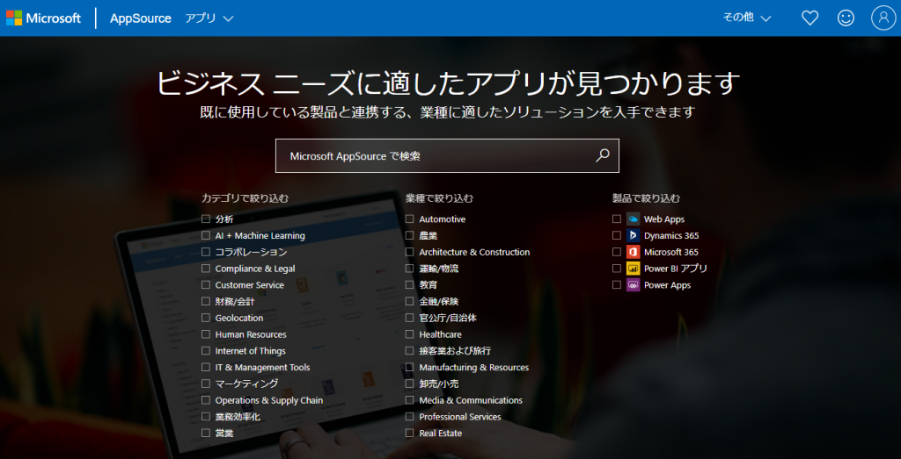
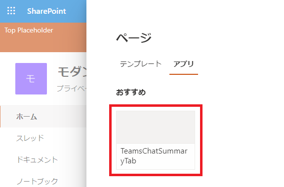

2020年7月17日に SharePoint Framework v1.11 がリリースされました。
この記事では v1.11 の変更点について気になるところだけ抜粋して記載します。
詳細は以下のリリースノートを確認してください。
[SharePoint Framework v1.11 release notes](https://docs.microsoft.com/ja-jp/sharepoint/dev/spfx/release-1.11.0?WT.mc_id=M365-MVP-4012897)
なお、SharePoint Framework v1.11 に対応した Docker イメージは [Docker Hub](https://hub.docker.com/r/orivers/spfx) からダウンロード可能です。

## SharePoint Framework で開発したプログラムの AppSource への公開に対応

- SharePoint Framework で開発したプログラムを Microsoft の [AppSource](https://appsource.microsoft.com/ja/) に公開できるようになりました。
- AppSource へ公開するために必要な事前チェックの内容やメンテナンスのルールなどが Doc に公開されています。
- 参考サイト：[Docs](https://docs.microsoft.com/ja-jp/sharepoint/dev/spfx/publish-to-marketplace-overview?WT.mc_id=M365-MVP-4012897)

## Teams の Messaging Extension の開発への対応

- Teams のメッセージの投稿やリアクションをする機能を拡張するための Messaging Extension を SharePoint Framework で開発できるようになりました。
- Messaging Extension の詳細については[こちら](https://docs.microsoft.com/ja-jp/microsoftteams/platform/messaging-extensions/what-are-messaging-extensions?view=msteams-client-js-latest&WT.mc_id=M365-MVP-4012897)を参照してください。
- 参考サイト：[Docs](https://docs.microsoft.com/en-us/sharepoint/dev/spfx/build-for-teams-expose-webparts-teams#expose-web-part-as-microsoft-teams-messaging-extension?WT.mc_id=M365-MVP-4012897)

## Single Part App Page 追加時のプレビュー画像表示への対応

- Single Part App Page を追加する際に、追加する Web パーツのプレビュー画像を Web パーツのマニフェストにて指定できるようになりました。
  下図、赤枠内の画像を指定できるようになりました。
  
- 参考サイト：[Docs](https://docs.microsoft.com/ja-jp/sharepoint/dev/spfx/web-parts/basics/configure-web-part-icon#set-the-single-part-app-page-preview-image?WT.mc_id=M365-MVP-4012897)

 
[AdSense-B]
