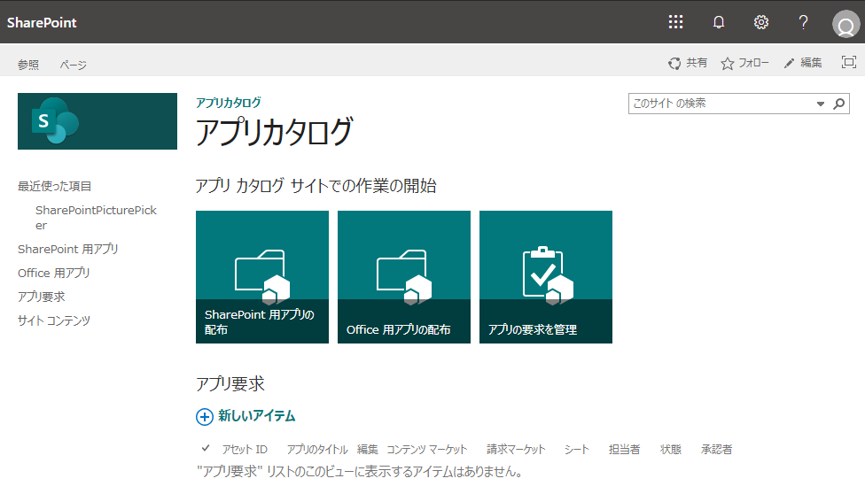
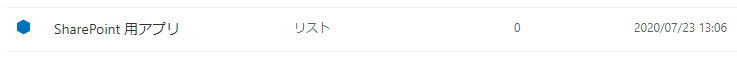
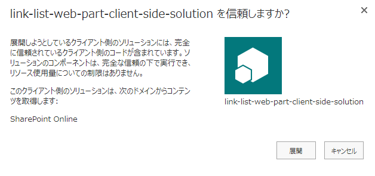
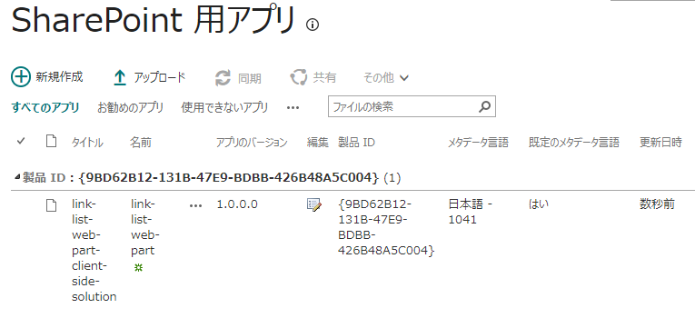
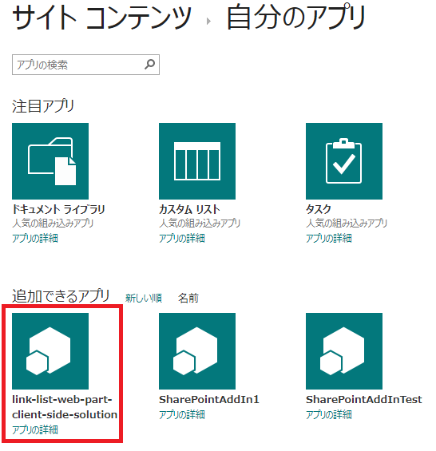
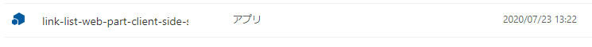

# はじめに

この記事では、開発環境にて SharePoint Framework で作成した Web パーツを本番環境にデプロイするための手順を説明します。
まだ SharePoint Framework で Web パーツを作成していない場合やビルドしていない場合は、以下の記事を参考に Web パーツを作ってください。

- [SharePoint Framework Web パーツ開発 その１：プロジェクトの作成](https://sharepoint.orivers.jp/article/10111)
- [SharePoint Framework Web パーツ開発 その２：ビルド&デバッグ](https://sharepoint.orivers.jp/article/10124)

# パッケージ作成手順

本番環境にデプロイするためには、SharePoint Framework で作成した Web パーツをデプロイするためのパッケージにまとめる必要があります。
パッケージファイルは、.sppkg というファイル拡張子の zip ファイルで、これを本番環境にデプロイすることになります。
ということで、まずはパッケージを作成する手順からです。

## プロジェクトを開き Docker を起動

※「[SharePoint Framework Web パーツ開発 その１：プロジェクトの作成](https://sharepoint.orivers.jp/article/10111)」の続きで作業を行う場合は、このステップは不要です。
Visual Studio Code を起動してメニューから ファイル > フォルダーを開く をクリックし、プロジェクトフォルダを開きます。
続いて、メニューから 表示 > ターミナル をクリックし、PowerShell のターミナルを開きます。
ターミナルに、 Docker を起動するためのコマンドを入力し実行します。
```
docker run -it --rm --name LinkListWebPart -v ${PWD}:/usr/app/spfx -p 4321:4321 -p 5432:5432 -p 35729:35729 orivers/spfx
```
無事、Docker が起動すると、以下のような表示になります。
```
spfx@1aff9c9c9d11:/usr/app/spfx$
```
以後、上記のプロンプトにコマンドを入力していきます。

## Bundle & Packaging

パッケージファイルを作るため、以下のコマンドを実行します。
```
gulp bundle --ship
```
コマンドを実行するとターミナルに以下のようにずらずらと文字が並びます。
```
spfx@8d21bb6d8125:/usr/app/spfx$ gulp bundle --ship
Build target: SHIP
[16:53:01] Using gulpfile /usr/app/spfx/gulpfile.js
[16:53:01] Starting gulp
[16:53:01] Starting 'bundle'...
[16:53:01] Starting subtask 'configure-sp-build-rig'...
[16:53:01] Finished subtask 'configure-sp-build-rig' after 16 ms
[16:53:01] Starting subtask 'pre-copy'...
[16:53:01] Finished subtask 'pre-copy' after 106 ms
[16:53:01] Starting subtask 'copy-static-assets'...
[16:53:01] Starting subtask 'sass'...
[16:53:01] Finished subtask 'copy-static-assets' after 95 ms
[16:53:02] Finished subtask 'sass' after 636 ms
[16:53:02] Starting subtask 'tslint'...
[16:53:06] [tslint] tslint version: 5.12.1
[16:53:06] Starting subtask 'tsc'...
[16:53:06] [tsc] typescript version: 3.3.4000
[16:53:10] Finished subtask 'tsc' after 3.77 s
[16:53:13] Finished subtask 'tslint' after 11 s
[16:53:13] Starting subtask 'post-copy'...
[16:53:13] Finished subtask 'post-copy' after 137 μs
[16:53:13] Starting subtask 'collectLocalizedResources'...
[16:53:13] Finished subtask 'collectLocalizedResources' after 6.8 ms
[16:53:13] Starting subtask 'configure-webpack'...
[16:53:18] Finished subtask 'configure-webpack' after 5.52 s
[16:53:18] Starting subtask 'webpack'...
[16:53:29] Finished subtask 'webpack' after 10 s
[16:53:29] Starting subtask 'configure-webpack-external-bundling'...
[16:53:29] Finished subtask 'configure-webpack-external-bundling' after 528 μs
[16:53:29] Starting subtask 'copy-assets'...
[16:53:29] Finished subtask 'copy-assets' after 73 ms
[16:53:29] Starting subtask 'write-manifests'...
[16:53:35] Finished subtask 'write-manifests' after 5.7 s
[16:53:35] Finished 'bundle' after 34 s
[16:53:35] ==================[ Finished ]==================
[16:53:36] Project link-list-web-part version:0.0.1
[16:53:36] Build tools version:3.12.1
[16:53:36] Node version:v10.16.3
[16:53:36] Total duration:1.23 min
```
続いてこちらのコマンドを実行します。
```
gulp package-solution --ship
```
実行結果はこちら。
```
spfx@8d21bb6d8125:/usr/app/spfx$ gulp package-solution --ship
Build target: SHIP
[17:13:45] Using gulpfile /usr/app/spfx/gulpfile.js
[17:13:45] Starting gulp
[17:13:45] Starting 'package-solution'...
[17:13:45] Starting subtask 'configure-sp-build-rig'...
[17:13:45] Finished subtask 'configure-sp-build-rig' after 16 ms
[17:13:45] Starting subtask 'package-solution'...
[17:13:45] [package-solution] Found manifest: /usr/app/spfx/temp/deploy/a00d214d-2ec6-4708-b6b3-bde20e813ede.json
[17:13:45] [package-solution] Found client-side build resource: link-list-web-part-web-part\_33bf31551ed21249a3c452d669b33591.js
[17:13:45] [package-solution] Found client-side build resource: spfx-linklistwebpartwebpartstrings\_en-us\_536e65149b0acf4d52c0043073b9fc59.js
[17:13:45] [package-solution] Found teams icons: a00d214d-2ec6-4708-b6b3-bde20e813ede\_color.png
[17:13:45] [package-solution] Found teams icons: a00d214d-2ec6-4708-b6b3-bde20e813ede\_outline.png
[17:13:45] Verifying configuration...
[17:13:45] Done!
[17:13:45]
[17:13:45] Normalizing solution information...
[17:13:45] Attempting creating component definitions for {1} manifests
[17:13:45] Created component definitions for {1} manifests
[17:13:45] config.solution.features not set! Instead generating a feature for each component.
[17:13:45] Creating feature for LinkListWebPart...
[17:13:45] Done!
[17:13:45]
[17:13:45] Reading custom Feature XML...
[17:13:45] Done!
[17:13:45]
[17:13:45] Validating App Package...
[17:13:45] Done!
[17:13:45]
[17:13:45] Reading resources...
[17:13:45] Done!
[17:13:45]
[17:13:45] Reading Sharepoint Assets & Creating XML...
[17:13:45] Done!
[17:13:45]
[17:13:45] Writing solution XML to sharepoint/solution/debug...
[17:13:45] Cleaned sharepoint/solution/debug
[17:13:45] Created file: sharepoint/solution/debug/ClientSideAssets/a00d214d-2ec6-4708-b6b3-bde20e813ede\_color.png
[17:13:45] Created file: sharepoint/solution/debug/AppManifest.xml
[17:13:45] Created file: sharepoint/solution/debug/\_rels/.rels
[17:13:45] Created file: sharepoint/solution/debug/[Content\_Types].xml
[17:13:45] Created file: sharepoint/solution/debug/ClientSideAssets.xml
[17:13:45] Created file: sharepoint/solution/debug/feature\_a00d214d-2ec6-4708-b6b3-bde20e813ede.xml
[17:13:45] Created file: sharepoint/solution/debug/feature\_a00d214d-2ec6-4708-b6b3-bde20e813ede.xml.config.xml
[17:13:45] Created file: sharepoint/solution/debug/a00d214d-2ec6-4708-b6b3-bde20e813ede/WebPart\_a00d214d-2ec6-4708-b6b3-bde20e813ede.xml
[17:13:45] Created file: sharepoint/solution/debug/ClientSideAssets.xml.config.xml
[17:13:45] Created file: sharepoint/solution/debug/ClientSideAssets/a00d214d-2ec6-4708-b6b3-bde20e813ede\_outline.png
[17:13:45] Created file: sharepoint/solution/debug/\_rels/AppManifest.xml.rels
[17:13:45] Created file: sharepoint/solution/debug/ClientSideAssets/link-list-web-part-web-part\_33bf31551ed21249a3c452d669b33591.js
[17:13:45] Created file: sharepoint/solution/debug/\_rels/ClientSideAssets.xml.rels
[17:13:45] Created file: sharepoint/solution/debug/\_rels/feature\_a00d214d-2ec6-4708-b6b3-bde20e813ede.xml.rels
[17:13:45] Created file: sharepoint/solution/debug/ClientSideAssets/spfx-linklistwebpartwebpartstrings\_en-us\_536e65149b0acf4d52c0043073b9fc59.js
[17:13:45] Created file: sharepoint/solution/link-list-web-part.sppkg
[17:13:45] Done!
[17:13:45]
[17:13:45] ALL DONE!
[17:13:45]
[17:13:45] Finished subtask 'package-solution' after 306 ms
[17:13:45] Finished 'package-solution' after 323 ms
[17:13:46] ==================[ Finished ]==================
[17:13:46] Project link-list-web-part version:0.0.1
[17:13:46] Build tools version:3.12.1
[17:13:46] Node version:v10.16.3
[17:13:46] Total duration:41 s
```
これでパッケージファイルが出来上がりました。
パッケージファイルは、以下のフォルダに .sppkg ファイルとして作成されます。
※斜体部分はプロジェクト名により変わります。
${PWD}/sharepoint/solution/*link-list-web-part.sppkg*

# パッケージのデプロイ手順

## アプリカタログを開く

パッケージファイルは SharePoint のアプリカタログにアップロードすることで利用できるようになります。
アプリカタログは、SharePoint 管理者があらかじめ SharePoint 管理センターや PowerShell を使って作成しておく必要があります。

アプリカタログを作成していない場合、以下の記事を参考にアプリカタログを作成してください。
[アプリカタログの作成](https://sharepoint.orivers.jp/article/10306)

## アプリカタログにパッケージをアップロードする

アプリカタログに先ほど作成した .sppkg ファイルをアップロードします。
アプリカタログは「SharePoint 用アプリ」という名前のライブラリなので、サイトコンテンツのページで見つけることができます。

.sppkg ファイルをアップロードすると、以下のダイアログが表示されるので、[展開] をクリックします。

これでサイトコレクションに展開する準備ができました。
なお、アップロード済みのパッケージは、下図の通り一覧表示されます。


## サイトコレクションにアプリを追加する

アプリカタログに登録されたパッケージは、SharePoint に「アプリ」として追加できるようになります。
サイトコンテンツページのメニューから [新規] > [アプリ] を選択し自分のアプリのページに移動すると、「追加できるアプリ」のところに先ほど追加したアプリが表示されていることを確認できるかと思います。

なお、アプリカタログに追加したアプリが多数ある場合は、サイトコンテンツページのメニューにある「組織から」 のリンクをクリックすると、テナントのアプリカタログやサイトコレクションにアプリカタログに登録された、自サイトで利用可能なアプリのみ表示することができます。
あとは他のアプリと同様に追加したいアプリをクリックすることで、そのサイトにアプリを展開することができます。
展開されたアプリは、リストなどのアプリと同様にサイトコンテンツの一覧の中に表示されます。

その後、Web パーツであれば、標準の Web パーツと同様に、ページに Web パーツを追加します。
以上が、SharePoint Framework で開発したアプリのデプロイ方法です。
[AdSense-B]
