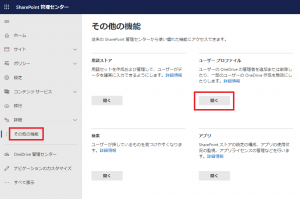
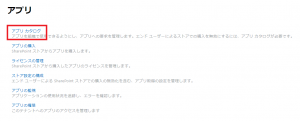
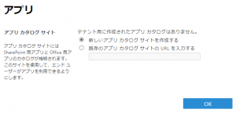
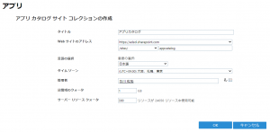
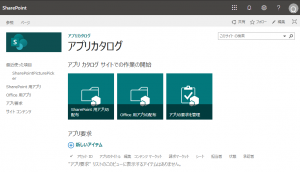

# はじめに

SharePoint Framework で開発したアプリをテナント内で利用するためには、「アプリカタログ」と呼ばれる場所にアプリのパッケージファイルをアップロードする必要があります。
この記事では、この「アプリカタログ」を作成するための手順を紹介します。

# アプリカタログの種類

## テナントアプリカタログ

テナント全体で使用するアプリを登録するためのアプリカタログです。
テナントアプリカタログに登録されたアプリは、テナント内のすべてのサイトコレクションに展開可能となり、特定のサイトコレクションに限定して展開することはできません。

## サイトコレクションアプリカタログ

サイトコレクションごとの個別のアプリカタログです。
サイトコレクション管理者は自身が管理するサイトコレクションにのみアプリを展開することができます。

# アプリカタログ作成手順

## テナントアプリカタログ

テナントアプリカタログは Microsoft 365 管理センターから作成します。
① Microsoft 365 管理センターにアクセスし、SharePoint 管理センターを開く。
② メニューから [その他の機能] をクリック、右ペインの [アプリ] の下の [開く] をクリックする。
[](/wp-content/uploads/2020/07/spfxdeploy-1.png)
③ [アプリ カタログ] をクリックする。
[](/wp-content/uploads/2020/07/spfxdeploy-2.png)
④ [新しいアプリ カタログ サイトを作成する] をクリックする。
[](/wp-content/uploads/2020/07/spfxdeploy-3.png)
⑤ アプリカタログを作成する。
必要事項を入力し、[OK] ボタンをクリックすると、アプリカタログのサイトコレクションが作成されます。
[](/wp-content/uploads/2020/07/spfxdeploy-4.png)
⑥ アプリカタログを開く。
アプリカタログはサイトコレクションなので、⑤で決めた URL にアクセスすると通常のサイトと同様に開くことができます。
[](/wp-content/uploads/2020/07/spfxdeploy-5.png)

## サイトコレクションアプリカタログ

サイトコレクションのアプリカタログは、SharePoint Online 管理シェルか、Office 365 CLI を使って作成します。
(この記事では SharePoint Online 管理シェルを使用します。)
なお、サイトコレクションアプリカタログを作成する前に、テナントアプリカタログを作成しておく必要があります。
SharePoint Online 管理シェルで以下のコマンドを実行します。
[Add-SPOSiteCollectionAppCatalog](https://docs.microsoft.com/ja-jp/powershell/module/sharepoint-online/add-spositecollectionappcatalog?view=sharepoint-ps&WT.mc_id=M365-MVP-4012897) コマンドレットの -Site パラメータには、アプリカタログを作成するサイトコレクションの URL を指定します。
```
Connect-SPOService -Url https://orivers-admin.sharepoint.com
Add-SPOSiteCollectionAppCatalog -Site https://orivers.sharepoint.com/sites/test
```
コマンドを実行すると、上記で指定したサイトコレクションに「SharePoint 用アプリ」という名前のリストが追加されます。
これが、サイトコレクションアプリカタログになります。
サイトコレクションアプリカタログに関する詳細は Docs を参照してください。
[サイトコレクションのアプリカタログを使用する](https://docs.microsoft.com/ja-jp/sharepoint/dev/general-development/site-collection-app-catalog?WT.mc_id=M365-MVP-4012897)
[AdSense-B]
