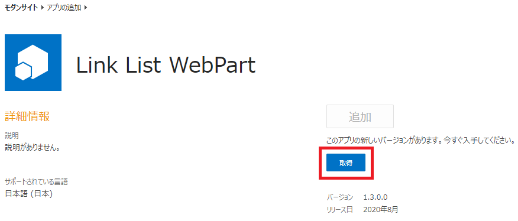

# はじめに

SharePoint Framework で開発した Web パーツなどのアプリのバージョンアップに伴う更新手順をまとめました。

# バージョンアップの手順

## /config/package-solution.json の書き換え

package-solution.json ファイルの 6 行目にある version 属性の値を新しいバージョン番号に変更します。
なお、バージョン番号は「メジャー.マイナー.リビジョン.ビルド」という 4 つのブロックで構成されています。
それぞれの数字が大きいほどバージョンが新しいということになります。
```
{
"$schema": "https://developer.microsoft.com/json-schemas/spfx-build/package-solution.schema.json",
"solution": {
"name": "LinkListWebPart",
"id": "9bd62b12-131b-47e9-bdbb-426b48a5c004",
"version": "1.3.0.0",
"includeClientSideAssets": true,
"isDomainIsolated": false,
```

## /package.json の書き換え

package.json の 3 行目にある version 属性の値を新しいバージョン番号に変更します。
なお、package.json のバージョン番号は「メジャー.マイナー.リビジョン」の 3 つのブロックしかありません。
これら 3 つのブロックの値は、分かりやすさのためにも package-solution.json の version 属性の値と同じにすることをお勧めします。
```
{
"name": "link-list-webpart",
"version": "1.3.0",
"private": true,
"main": "lib/index.js",
"engines": {
"node": ">=0.10.0"
},
```

## パッケージファイルの作成

gulp bundle --ship とgulp package-solution --ship を実行しパッケージファイルを作成します。

## アプリカタログに上書きアップロード

アプリカタログに新バージョンのパッケージファイルをアップロードします。
これにより、アプリカタログにアップロード済みの前バージョンのパッケージファイルが更新されます。
また、このタイミングでアプリ本体（.js、.css など）が更新され、新しいバージョンのアプリが即時使用されるようになります。

## パッケージ情報の更新

アプリ本体はアプリカタログにパッケージファイルを上書きアップロードした時点で更新されますが、package-solution.json に記載した内容はこのままでは更新されません。
新バージョンの package-solution.json の内容を適用するためには、明示的な更新操作が必要です。
サイトコンテンツからバージョンアップしたいアプリの右クリックメニューを表示して、[詳細] をクリックし、アプリの詳細ダイアログを表示します。
詳細ダイアログの [取得] ボタンをクリックすることで、新バージョンの package-solution.json の内容が反映されます。

以上が、SharePoint Framework で開発したアプリのバージョンアップ手順です。

# 注意点

- アプリ本体のバージョンアップだけであれば、新バージョンのパッケージファイルをアプリカタログに上書きアップロードするだけです。
  これだけで、同一のアプリカタログのアプリを使っている全てのサイトに新バージョンが展開可能です。
  逆に言うと、それだけで多くのサイトに影響を与えてしまうことになるため、新バージョンの展開には注意が必要です。
- バージョン番号を変えずにコードのみ変更したバージョンをアプリカタログにアップロードした場合や、いずれかのサイトでアプリが使用中であるにも関わらず、アプリカタログからパッケージファイルを削除すると、アプリの情報が破損する可能性がありますとのこと。（実際破損したことはないのですが・・・）

# 参考

[SharePoint Framework におけるチーム ベースの開発](https://docs.microsoft.com/ja-jp/sharepoint/dev/spfx/team-based-development-on-sharepoint-framework#upgrading-sharepoint-framework-projects?WT.mc_id=M365-MVP-4012897)
[AdSense-B]
