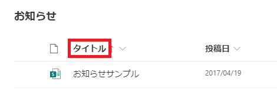

# はじめに

SharePoint の REST API を使ってアイテムを取得する際に $select を付けて特定の列名のみピックアップすることができますが、$select に指定する列名を取得する方法についてまとめました。

# $select に指定する列名

$select には、列のタイトルではなく内部名と言われるものを指定する必要があります。
列のタイトルと内部名はそれぞれ以下で確認可能です。
**列のタイトル：リストのビューや設定ページに表示される列名（赤枠内）**

**列の内部名：リストのビューで列でフィルタやソートをした際のURLに含まれる値（赤字箇所）**
https://[サイトのURL]/Lists/List1/AllItems.aspx?sortField=LinkTitle&isAscending=true&viewid=e1824b1e%2D97a3%2D4ea7%2D9524%2D1f088f5210a2
SharePoint 標準の列や自分で追加した英語名の列であれば上記の内部名を確認し $select に指定すればよいのですが、日本語名で列を作成した場合や極一部の標準の列は、以下の URL のように $select に内部名を指定してもエラーとなり列の値を取得することができません。
/\_api/web/lists/getbytitle('お知らせ')/items?$select=[日本語名で作成した列の内部名/極一部の標準の列の内部名]

# 内部名で値を取得できない列を $select で指定する方法

内部名で値を取得できない列を $select に指定したい場合は、内部名（InternalName）を使用するのではなく、**EntityPropertyName** の値を指定する必要があります。
以下の REST API をコールしてみると、EntityPropertyName の値を確認することができます。
/\_api/web/lists/getbytitle('お知らせ')/fields
**上記 REST API コールの結果からの抜粋**
```
"Title": "タイトル",
"InternalName": "Title",
"EntityPropertyName": "Title",
"Title": "更新日時",
"InternalName": "Modified",
"EntityPropertyName": "Modified",
"Title": "承認者のコメント",
"InternalName": "\_ModerationComments",
"EntityPropertyName": "OData\_\_ModerationComments",
"Title": "Test",
"InternalName": "Test",
"EntityPropertyName": "Test",
"Title": "テスト"
"InternalName": "\_x30c6\_\_x30b9\_\_x30c8\_"
"EntityPropertyName": "OData\_\_x30c6\_\_x30b9\_\_x30c8\_"
```
日本語名で列を作成した場合(17～19行目)や [承認者のコメント] 列(9～11行目)のように一部の列では、"OData\_" という文字列が InternalName の先頭に付加された値が EntityPropertyName に設定されていることが確認できます。
REST API をコールする際にはこの "OData\_" という記載が必要になるため、EntityPropertyName を使用する必要があるということになります。
まとめると、上記結果に含む列を取得する場合は、以下の URL になります。
/\_api/web/lists/getbytitle('お知らせ')/items?$select=Title,Modified,OData\_\_ModerationComments,Test,OData\_\_x30c6\_\_x30b9\_\_x30c8\_
[AdSense-B]
