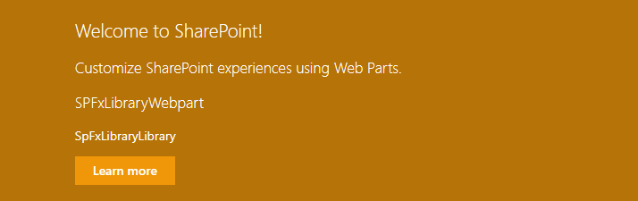
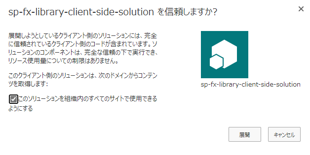

# はじめに

SharePoint Framework v1.9.1 で GA となったライブラリコンポーネントの開発について、[docs](https://docs.microsoft.com/ja-jp/sharepoint/dev/spfx/library-component-tutorial?WT.mc_id=M365-MVP-4012897) を参考に docker 環境で実際に開発をしてみました。

# ライブラリコンポーネントとは

ライブラリコンポーネントは、SharePoint Framework で開発されたコードを複数のプロジェクトで共有するための仕組みです。
あらかじめライブラリコンポーネントとして開発しておいたパッケージファイルをアプリカタログにアップすることで、SharePoint Framework で開発された他のコンポーネントから参照することが可能となります。

# ライブラリコンポーネントの開発

docker で SharePoint Framework の開発環境を構築している場合の手順を含めながら、ライブラリコンポーネントを開発し参照する流れを記載します。

## プロジェクトルートフォルダの作成

ライブラリコンポーネントとライブラリを参照するプロジェクトの両方を配下に含むためのプロジェクルートフォルダを作成します。
この記事ではサンプルとして「SPFxLibraryTest」とします。
フォルダ作成後、このフォルダを VSCode で開きます。

## ライブラリプロジェクトフォルダの作成

プロジェクトルートフォルダの配下にライブラリコンポーネント用のプロジェクトフォルダを作成します。
この記事ではサンプルとして「SPFxLibrary」とします。

## ライブラリプロジェクトの作成

プロジェクトルートフォルダを起点として docker を起動します。
```
docker run -it --rm --name SPFxLibraryTest -v ${PWD}:/usr/app/spfx -p 4321:4321 -p 5432:5432 -p 35729:35729 orivers/spfx:latest
```
docker コンソール上でライブラリプロジェクトフォルダに移動し、Yeoman SharePoint ジェネレーターでライブラリプロジェクトを作成します。
```
==========================================================================
We're constantly looking for ways to make yo better!
May we anonymously report usage statistics to improve the tool over time?
More info: https://github.com/yeoman/insight & http://yeoman.io
========================================================================== Yes
\_-----\_
| | .--------------------------.
|--(o)--| | Welcome to the |
`---------´ | SharePoint Client-side |
( \_´U`\_ ) | Solution Generator |
/\_\_\_A\_\_\_\ '--------------------------'
| ~ |
\_\_'.\_\_\_.'\_\_
´ ` |° ´ Y `
The yarn package manager will be used.
Let's create a new SharePoint solution.
? What is your solution name? SPFxLibrary
? Which baseline packages do you want to target for your component(s)? SharePoint Online only (latest)
? Where do you want to place the files? Use the current folder
Found yarn version 1.17.3
? Do you want to allow the tenant admin the choice of being able to deploy the solution to all sites immediately without running any feature deployment or adding apps in sites? Yes
? Will the components in the solution require permissions to access web APIs that are unique and not shared with other components in the tenant? No
? Which type of client-side component to create? Library
Add new Library to solution sp-fx-library.
? What is your Library name? SPFxLibrary
? What is your Library description? SPFxLibrary description
```
yo sharepoint のポイントは以下の通りです。

- 23 行目
  「Do you want to allow the tenant admin the choice of being able to deploy the solution to all sites immediately without running any feature deployment or adding apps in sites?」にて「Yes」選択します。
- 25 行目
  「 Which type of client-side component to create?」にて「Library」を選択します。

この記事では、生成されるソースコードは特に変更せずこのまま使用します。
続いて、以下のコマンドを実行してパッケージファイルを作成しビルドエラー等が発生しないことを確認します。
```
gulp build --ship
gulp package-solution --ship
```

## ライブラリを参照するためのシンボリックリンクの登録

ライブラリコンポーネントを他のプロジェクトから参照するためにはシンボリックリンクの登録が必要です。
ライブラリコンポーネントのプロジェクトフォルダにて、以下のコマンドを docker コンソールにて実行します。
パッケージマネージャとして npm を使用する場合：
```
npm link
```
パッケージマネージャとして yarn を使用する場合：
```
yarn link
```
続いて、以下のコマンドを実行します。
```
gulp build
```

## ライブラリを参照するプロジェクトのプロジェクトフォルダを作成

ライブラリコンポーネントを参照するプロジェクトのプロジェクトフォルダをルートプロジェクトフォルダ配下に作成します。
この記事ではサンプルとして「SPFxLibraryWebpart」とします。

## ライブラリを参照するプロジェクトの作成

ライブラリコンポーネントを参照するプロジェクトとして Web パーツのプロジェクトを作成します。
docker コンソールにて Web パーツプロジェクトのフォルダへ移動し、下記手順を参考にプロジェクトを作成します。
[SharePoint Framework Web パーツ開発 その１：プロジェクトの作成](https://sharepoint.orivers.jp/article/10111)
[SharePoint Framework Web パーツ開発 その２：ビルド&デバッグ](https://sharepoint.orivers.jp/article/10124)

## ライブラリへの参照の追加

docker コンソールにて Web パーツプロジェクトのプロジェクトフォルダへ移動し、以下のコマンドを実行してライブラリコンポーネントへの参照を追加します。
パッケージマネージャとして npm を使用する場合：
```
npm link sp-fx-library
```
パッケージマネージャとして yarn を使用する場合：
```
yarn link sp-fx-library
```
ライブラリコンポーネントを参照するためのコードを Web パーツ本体の .ts ファイル （SpFxLibraryWebpartWebPart.ts）に追加します。
```
import \* as myLibrary from 'sp-fx-library';
```
なお、from の後のライブラリ名は、ライブラリコンポーネントプロジェクトの「package.json」に記載があります。（下記コードの 2 行目）
```
{
"name": "sp-fx-library",
"version": "0.0.1",
"private": false,
"main": "lib/index.js",
"engines": {
"node": ">=0.10.0"
},
```
render メソッドにて、ライブラリコンポーネントが提供するファンクションをコールするコードを追加します。（下記コードの 2 行目、12 行目）
```
public render(): void {
const instance = new myLibrary.SpFxLibraryLibrary;
this.domElement.innerHTML = `
<div class="${ styles.spFxLibraryWebpart }">
<div class="${ styles.container }">
<div class="${ styles.row }">
<div class="${ styles.column }">
<span class="${ styles.title }">Welcome to SharePoint!</span>
<p class="${ styles.subTitle }">Customize SharePoint experiences using Web Parts.</p>
<p class="${ styles.description }">${escape(this.properties.description)}</p>
<p>${instance.name()}</p>
<a href="https://aka.ms/spfx" class="${ styles.button }">
<span class="${ styles.label }">Learn more</span>
</a>
</div>
</div>
</div>
</div>`;
}
```

# ローカルワークベンチでのデバッグ

Web パーツプロジェクトをローカルワークベンチでデバッグ実行して、ライブラリコンポーネントを読み込むことができているかどうかを確認します。

## デバッグ実行のための準備

VSCode でデバッグ実行を行う場合、VSCode で開いているフォルダの直下に .vscode フォルダとその下に launch.json ファイルが必要です。
デバッグ実行では Web プロジェクトを実行する必要があるので、プロジェクトルートフォルダの下に .vscode フォルダを作成し、Web プロジェクトに含まれる launch.json ファイルをコピーします。

## デバッグ実行

docker コンソールで Web プロジェクトフォルダに移動し、以下のコマンドを実行します。
```
gulp serve
```
続いて、VSCode にてデバッグ実行を開始します。
Web パーツをページに追加し、下図の通り「SPFxLibraryWebpart」の表記の下に「SpFxLibraryLibrary」と表記されていれば、ライブラリコンポーネントの呼び出しが成功したということになります。


# テナントへの展開

先の手順で作成したライブラリコンポーネントのパッケージファイルをテナントのアプリカタログにアップロードすることで、テナント全体でライブラリコンポーネントが共有されます。
アップロードする際「このソリューションを組織内のすべてのサイトで使用できるようにする」にチェックを入れます。

# まとめ

今回はライブラリコンポーネントの開発と参照の仕方をまとめました。
ライブラリコンポーネントは GA されていますが、テナントに展開されたライブラリコンポーネントを直接参照して開発できるようになるとさらに便利だなと思いつつ、次のアップデートに期待したいと思います。
[AdSense-B]
