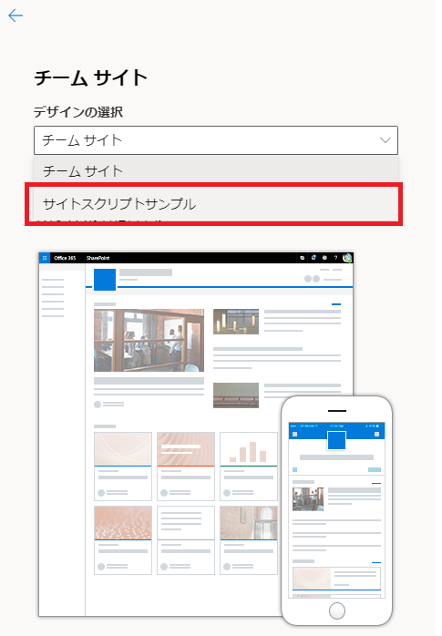
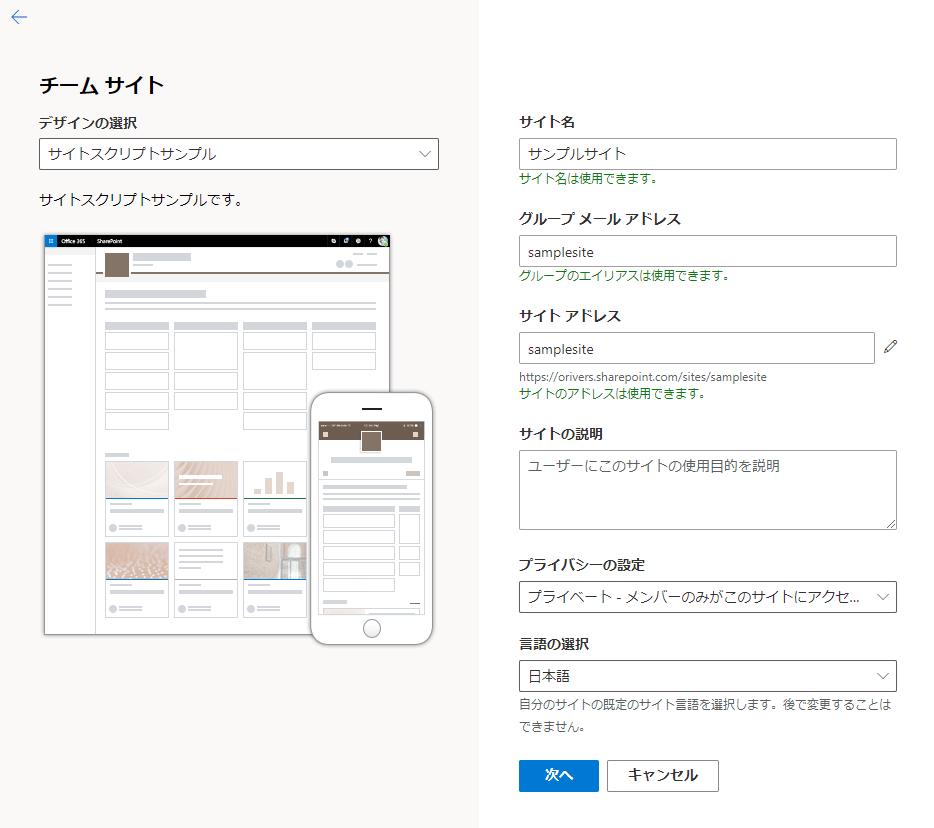
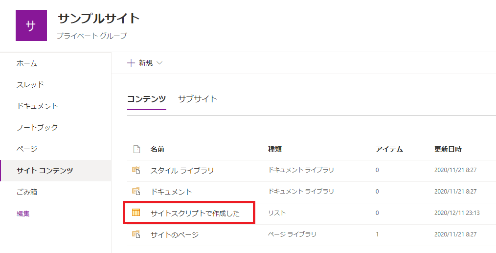
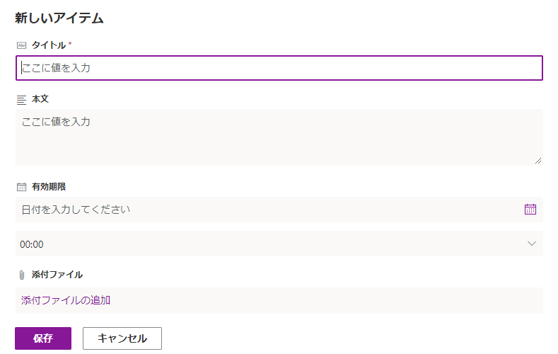
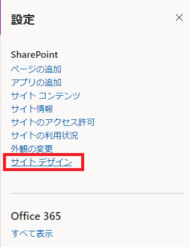
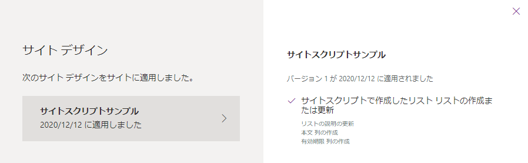

# はじめに

モダンサイトのサイトテンプレート機能により、サイトの構造をテンプレート化して横展開することが可能となります。
このサイトテンプレート機能の使い方を複数回に分けて紹介します。

- サイトテンプレートとサイトスクリプト（本記事）
- [サイトテンプレートの作成と登録](https://sharepoint.orivers.jp/article/10434)
- [既存サイトのテンプレート化](https://sharepoint.orivers.jp/article/10466)

# サイトテンプレート、サイトスクリプトとは

サイトテンプレートは、[docs](https://docs.microsoft.com/ja-jp/sharepoint/dev/declarative-customization/site-design-overview?WT.mc_id=M365-MVP-4012897) に記載がある通り、クラシックサイトのサイトテンプレートに似たモダンサイト用の機能です。
サイトテンプレートには、サイトに適用するテーマや自動生成するリスト等を含めることができ、新規サイト作成時や作成済みのサイトに対して適用することができます。
サイトテンプレートは複数のサイトスクリプトで構成されています。
サイトスクリプトは、JSON で記述する定義情報で、この中にテーマやリストの情報を含めることができます。
サイトテンプレートを適用すると、サイトテンプレートに紐づく全てのサイトスクリプトが実行されて、サイトのテーマの変更やリストの追加が行われます。
サイトスクリプトは、既存のサイトやリストを元に作成することができるため、既存サイトと同じ構成のサイトを作成するといったこともできるようになります。
サイトテンプレートを使用することでモダンサイトをテンプレート化して複製するようなことが可能になりますが、サイトテンプレートを使ってできることは現時点では限定的なため、クラシックサイトのサイトテンプレートやリストテンプレートと比べると機能的には劣ります。
それでも、モダンサイトのテンプレート化が全くできないという状態よりはだいぶ良いと思うので活用していきたいところです。
なお、「サイトテンプレート」は以前「サイトデザイン」と呼ばれていました。
そのため、マイクロソフトの公式ドキュメントでは一部「サイトデザイン」と記載されている箇所があります。
また、サイトテンプレートを取り扱う PowerShell コマンドレットも「サイトデザイン」時代の名残があります。

# サイトテンプレートを使うための準備

サイトテンプレートは PowerShell または REST API にて使用することができますが、この記事では PowerShell を使用する手順を記載します。
PowerShell でサイトテンプレートを使うためには、SharePoint Online Management Shell を使用します。
インストールしていない場合は、こちらからダウンロードしてインストールしてください。
[Download SharePoint Online Management Shell from Official Microsoft Download Center](https://www.microsoft.com/ja-jp/download/details.aspx?id=35588)
あるいは、PowerShell を起動して以下のコマンドを実行し SharePoint のモジュールをインストールするのでも OK です。
```
Install-Module -Name Microsoft.Online.SharePoint.PowerShell
```
なお、この記事では SharePoint Online Management Shell を使用します。
SharePoint Online Management Shell 起動後は、必要に応じてSharePointのPowerShell モジュールをアップデートします。
```
Update-Module -Name Microsoft.Online.SharePoint.PowerShell
```
これで準備完了です。

# サイトテンプレートを使ったサイト作成

サイトテンプレートを使ったサイト作成の流れを記載します。
サイトテンプレートは SharePoint Online のモダンサイトにおけるサイト作成の流れの中に完全に組み込まれています。
従って、ユーザーは特別な操作をすることなく、独自のサイトテンプレートを使ってサイトを作成することができます。
以下にサイトテンプレートを適用してサイトを作成する流れを記載ます。
SharePoint Online にてサイトを新規作成します。

[デザインの選択] のプルダウンに標準のデザインの他に、予め作成した独自のサイトテンプレートが表示されます。（下図赤枠）

[デザインの選択] で適用するデザインを選択し、[サイト名] など必要項目を入力しサイトを作成します。
サイト作成処理の中で、サイトテンプレートに紐づくサイトスクリプトが実行され、サイトが自動的にカスタマイズされます。

作成されたサイトを見ると、チームサイトの標準にはないリストが追加されていることが確認できます。

追加するリストには列やビューも追加することができます。

サイトテンプレートによりどのような処理が実行されたのかを確認する場合は、歯車マークから [サイトデザイン] をクリックします。

下図の通り、処理内容が表示されます。

[次の記事](https://sharepoint.orivers.jp/article/10434)ではサイトテンプレートの作成方法を記載します。
[AdSense-B]
