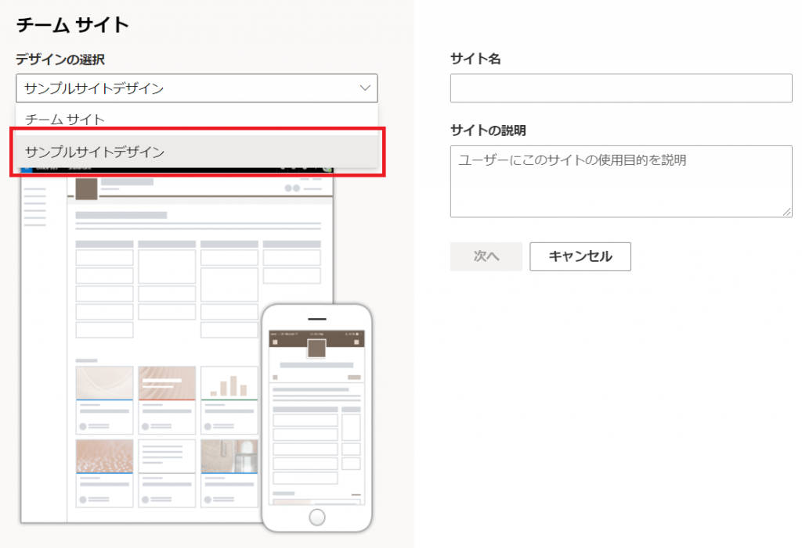

# はじめに

モダンサイトのサイトテンプレート機能により、サイトの構造をテンプレート化して横展開することが可能となります。
このサイトテンプレート機能の使い方を複数回に分けて紹介します。

- [サイトテンプレートとサイトスクリプト](https://sharepoint.orivers.jp/article/10416)
- サイトテンプレートの作成と登録（本記事）
- [既存サイトのテンプレート化](https://sharepoint.orivers.jp/article/10466)

今回はサイトテンプレートの作成と登録ということで、サイトテンプレートの作り方などを記載します。

# サイトテンプレートとサイトスクリプトの正体

サイトスクリプトは、サイトの設定やリストの設定に関する定義情報です。
このサイトスクリプトを複数組み合わせて、ひとつのセットにしたものをサイトテンプレートと呼びます。
サイトスクリプトの実体は JSON データです。
JSON データとして定義情報を書き、これをサイトテンプレートとしてまとめて、サイトテンプレート単位でサイトに適用します。
前の記事でサイトテンプレートを適用する流れを記載しましたが、その際に使ったサイトスクリプトはこちらになります。
```
{
"$schema": "https://developer.microsoft.com/json-schemas/sp/site-design-script-actions.schema.json",
"actions": [
{
"verb": "createSPList",
"listName": "サイトスクリプトで作成したリスト",
"templateType": 100,
"subactions": [
{
"verb": "setDescription",
"description": "サイトスクリプトで作成したリストです。"
},
{
"verb": "addSPField",
"id": "4c35f233-238a-473b-8b68-a13805631932",
"fieldType": "Note",
"displayName": "本文",
"internalName": "Body",
"isRequired": false,
"addToDefaultView": false
},
{
"verb": "addSPField",
"id": "c97e1afa-f634-4c74-8fbd-977b1c994078",
"fieldType": "DateTime",
"displayName": "有効期限",
"internalName": "ExpireDate",
"isRequired": false,
"addToDefaultView": false
}
]
}
]
}
```
※ [docs](https://docs.microsoft.com/ja-jp/sharepoint/dev/declarative-customization/get-started-create-site-design#create-the-site-script-in-json?WT.mc_id=M365-MVP-4012897) にもサイトスクリプトのサンプルが掲載されています。
サイトスクリプトの記述の仕方は [docs](https://docs.microsoft.com/ja-jp/sharepoint/dev/declarative-customization/site-design-json-schema?WT.mc_id=M365-MVP-4012897) に記載があるので詳細は割愛します。

# サイトスクリプト作成のポイント

サイトスクリプトはひとつの JSON ファイルで、ファイルの中にはサイトに適用するアクションを多数列挙することができます。
アクションは上から順に適用されるようになっています。
アクションは、アクションの種類を指定する「verb」属性と、verb の種類ごとに定義された属性で構成されています。
指定可能な verb と verb ごとの属性は [docs](https://docs.microsoft.com/ja-jp/sharepoint/dev/declarative-customization/site-design-json-schema?WT.mc_id=M365-MVP-4012897) に記載があるので参照してください。
サイトスクリプトは JSON ファイルとして管理ができるので、意味のある単位でサイトスクリプトファイルを作っておくことで、再利用することができます。
サイトスクリプトにはいくつか制限事項があるので、以下にまとめます。（2021年2月時点）

- サイトスクリプトに含めることができるアクションの上限値
  300 個（または、100,000文字）　※ただし Invoke-SPOSiteDesign コマンドでスクリプトを実行する場合は 30 個
- テナントに登録可能なサイトスクリプト及びサイトテンプレートの数
  100 個
- サイトスクリプト内に日本語を含む場合は文字コードを Shift-JIS にして保存

# サイトテンプレート及びサイトスクリプトの登録

サイトテンプレートとサイトスクリプトを利用できるようにするためには、あらかじめテナントに登録する必要があります。
登録は以下の手順で行います。

1. Get-Content コマンドレットでサイトスクリプトファイル (json ファイル) をロード（下記 2 行目）
2. Add-SPOSiteScript コマンドレットでサイトスクリプトをテナントに登録（下記 3 行目）
3. Add-SPOSiteDesign コマンドレットでサイトテンプレートをテナントに登録（下記 12 行目）

以下は、SharePoint Online Management Shell でのコマンドの例です。
```
Connect-SPOService https://orivers-admin.sharepoint.com
$content = Get-Content "D:\sample-sitescript.json" -Raw
Add-SPOSiteScript -Title "サンプルサイトスクリプト" -Content $content -Description "サンプルサイトスクリプトです。"
Id : 5f1fa67a-ba6e-4640-bec5-adcb206e4299
Title : サンプルサイトスクリプト
Description : サンプルサイトスクリプトです。
Content :
Version : 0
IsSiteScriptPackage : False
Add-SPOSiteDesign -Title "サンプルサイトデザイン" -WebTemplate 64 -SiteScripts "5f1fa67a-ba6e-4640-bec5-adcb206e4299" -Description "サンプルサイトデザインです。"
Id : daf299fc-d6ff-4556-8659-5f6b65f00bdf
Title : サンプルサイトデザイン
WebTemplate : 64
SiteScriptIds : {5f1fa67a-ba6e-4640-bec5-adcb206e4299}
Description : サンプルサイトデザインです。
PreviewImageUrl :
PreviewImageAltText :
IsDefault : False
Version : 1
DesignPackageId : 00000000-0000-0000-0000-000000000000
```
なお、12 行目の Add-SPOSiteDesign コマンドレットのパラメータ「WebTeamplate」は、サイトテンプレートを有効化するサイトテンプレートの ID を指定します。
サイトテンプレート ID については、[こちらの記事](https://sharepoint.orivers.jp/article/10432)に一覧を作成していますが、これらのどれにサイトテンプレートを適用することができるかは確認していません。
少なくとも、チームサイト (サイトテンプレート ID : 64)、コミュニケーションサイト (サイトテンプレート ID : 68)、Microsoft 365 グループなしのチーム サイト (サイトテンプレート ID : 1) は適用可能です。
無事登録できると、下図のようにサイト作成時に「デザインの選択」の欄に作成したサイトテンプレートが表示されます。

 
[次の記事](https://sharepoint.orivers.jp/article/10466)では、既存のサイトからサイトテンプレートを生成する方法について記載します。
[AdSense-B]
