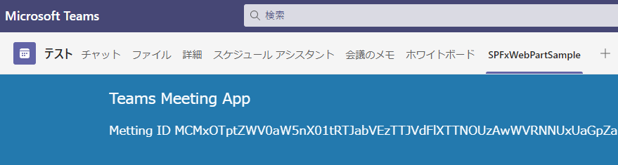

2021年4月28日に SharePoint Framework v1.12.1 がリリースされました。
この記事では v1.12.1 の変更点について気になるところだけ抜粋して記載します。
詳細は以下のリリースノートを確認してください。
[SharePoint Framework v1.12.1 release notes](https://docs.microsoft.com/ja-jp/sharepoint/dev/spfx/release-1.12.1?WT.mc_id=M365-MVP-4012897)
なお、SharePoint Framework v1.12.1 に対応した Docker イメージは [Docker Hub](https://hub.docker.com/r/orivers/spfx) からダウンロード可能です。

## [Teams に同期] ボタンによる Teams アプリマニフェストの自動生成

- アプリカタログにある [Teams に同期] ボタンをクリックすると、Teams アプリのマニフェストファイルが未作成の場合は自動的に作成されるようになりました。
- 参考情報：[Docs](https://docs.microsoft.com/ja-jp/sharepoint/dev/spfx/deployment-spfx-teams-solutions?WT.mc_id=M365-MVP-4012897)

## Web パーツがレンダリングされた際の実際の幅を取得するプロパティと変更イベントの追加

- Web パーツがレンダリングされた際の実際の幅を取得するプロパティとして、Web パーツを表すクラス BaseClientSideWebPart に Width プロパティが追加されました。
  また、Width が変更されたことを検知するために OnAfterResize イベントが追加されました。
- これらを使用することで、Web パーツの幅に応じたスタイルの調整などができるようになります。
- 参考情報：[Docs](https://docs.microsoft.com/ja-jp/sharepoint/dev/spfx/web-parts/basics/determine-web-part-width?WT.mc_id=M365-MVP-4012897)

## リスト通知機能のリスト対応

- これまでドキュメントライブラリにだけ対応していたリスト通機能がリストにも対応しました。
- 参考情報：[ライブラリの変更通知を Web パーツで受信する](https://sharepoint.orivers.jp/article/10185)

## Teams 会議アプリの暫定サポート

- Teams 会議のタブに追加する会議アプリが暫定的にサポートされました。
- 完全なサポートは次回以降のリリースで行われるようです。

## Node.js など依存ツールのバージョン変更

- Node.js の対応バージョンに v12.13.x、v14.15.x が加わりました。
- 上記バージョンを使用する場合、Gulp のバージョンを v4 にする必要があります。

## ローカルワークベンチが非推奨に変更

- これまで Web パーツ開発で使用していたローカルワークベンチが非推奨となりました。
- 今回の SPFx のバージョンがローカルワークベンチを含む最後のリリースとなります。
- 今後は、ローカルワークベンチは使わずに、最初から SPO 開発者サイト等でデバッグを行うこととなります。

 
[AdSense-B]
