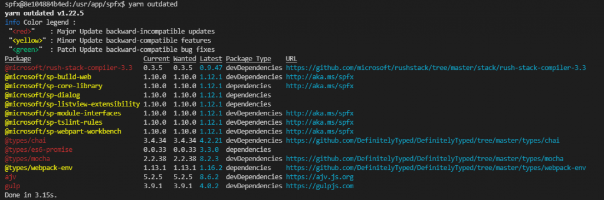
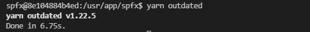

# はじめに

SharePoint Framework で以前作ったアプリを最新の SharePoint Framework 開発環境で bundle しようとしたところエラーが出て bundle が失敗しました。
上記のように以前作ったアプリを最新バージョンに対応させるということは度々発生すると思うので、基本的なバージョンアップ方法について docs をもとに試してみました。
docs
[SharePoint Framework のパッケージの更新](https://docs.microsoft.com/ja-jp/sharepoint/dev/spfx/toolchain/update-latest-packages?WT.mc_id=M365-MVP-4012897)

# bundle 時に発生したエラー

もともと SPFx v1.10.0 で実装していた Web パーツを SPFx v1.12.1 環境で「gulp bundle --ship」したところ、以下のエラーが発生しました。
```
spfx@8e104884b4ed:/usr/app/spfx$ gulp bundle --ship
Error: Node Sass does not yet support your current environment: Linux 64-bit with Unsupported runtime (83)
For more information on which environments are supported please see:
https://github.com/sass/node-sass/releases/tag/v4.12.0
at module.exports (/usr/app/spfx/node\_modules/node-sass/lib/binding.js:13:13)
at Object.<anonymous> (/usr/app/spfx/node\_modules/node-sass/lib/index.js:14:35)
at Module.\_compile (internal/modules/cjs/loader.js:1068:30)
at Object.Module.\_extensions..js (internal/modules/cjs/loader.js:1097:10)
at Module.load (internal/modules/cjs/loader.js:933:32)
at Function.Module.\_load (internal/modules/cjs/loader.js:774:14)
at Module.require (internal/modules/cjs/loader.js:957:19)
at require (internal/modules/cjs/helpers.js:88:18)
at Object.<anonymous> (/usr/app/spfx/node\_modules/@microsoft/gulp-core-build-sass/lib/SassTask.js:11:18)
at Module.\_compile (internal/modules/cjs/loader.js:1068:30)
```
上記のエラーメッセージをもとにネットで検索してみると、パッケージが古いため最新化しましょうといったものが見つかったため、なるほど SPFx v1.12.0 環境で SPFx v1.10.0 の Web パーツを扱ったために諸々バージョンが合わなくてエラーになったのだなと分かり、パッケージの最新化を行うことにしました。

# 古いパッケージを見つける

実際に今の環境でどのパッケージが古くなっているのかを調べるために、以下のコマンドを実行します。
npm の場合
```
npm outdated
```
yarn の場合
```
yarn outdated
```
私は yarn 好きなので、yarn での実行結果を記載します。
```
spfx@8e104884b4ed:/usr/app/spfx$ yarn outdated
yarn outdated v1.22.5
info Color legend :
"<red>" : Major Update backward-incompatible updates
"<yellow>" : Minor Update backward-compatible features
"<green>" : Patch Update backward-compatible bug fixes
Package Current Wanted Latest Package Type URL
@microsoft/rush-stack-compiler-3.3 0.3.5 0.3.5 0.9.47 devDependencies https://github.com/microsoft/rushstack/tree/master/stack/rush-stack-compiler-3.3
@microsoft/sp-build-web 1.10.0 1.10.0 1.12.1 devDependencies http://aka.ms/spfx
@microsoft/sp-core-library 1.10.0 1.10.0 1.12.1 dependencies http://aka.ms/spfx
@microsoft/sp-dialog 1.10.0 1.10.0 1.12.1 dependencies
@microsoft/sp-listview-extensibility 1.10.0 1.10.0 1.12.1 dependencies
@microsoft/sp-module-interfaces 1.10.0 1.10.0 1.12.1 devDependencies http://aka.ms/spfx
@microsoft/sp-tslint-rules 1.10.0 1.10.0 1.12.1 devDependencies http://aka.ms/spfx
@microsoft/sp-webpart-workbench 1.10.0 1.10.0 1.12.1 devDependencies http://aka.ms/spfx
@types/chai 3.4.34 3.4.34 4.2.21 devDependencies https://github.com/DefinitelyTyped/DefinitelyTyped/tree/master/types/chai
@types/es6-promise 0.0.33 0.0.33 3.3.0 dependencies
@types/mocha 2.2.38 2.2.38 8.2.3 devDependencies https://github.com/DefinitelyTyped/DefinitelyTyped/tree/master/types/mocha
@types/webpack-env 1.13.1 1.13.1 1.16.2 dependencies https://github.com/DefinitelyTyped/DefinitelyTyped/tree/master/types/webpack-env
ajv 5.2.5 5.2.5 8.6.2 devDependencies https://ajv.js.org
gulp 3.9.1 3.9.1 4.0.2 devDependencies https://gulpjs.com
Done in 3.15s.
```
テキストで書くと分かりづらいのですが、実際には下図の通り色が付いて表示されるため古いパッケージがひと目でわかります。


# 古いパッケージを最新化する

古いパッケージを最新化するには以下のコマンドを実行します。
npm の場合
```
npm install [パッケージ名] --save
```
yarn の場合
```
yarn add [パッケージ名]
```
以下、yarn での実行結果です。
```
spfx@8e104884b4ed:/usr/app/spfx$ yarn add @microsoft/sp-core-library
yarn add v1.22.5
[1/5] Validating package.json...
[2/5] Resolving packages...
[3/5] Fetching packages...
info fsevents@2.3.2: The platform "linux" is incompatible with this module.
info "fsevents@2.3.2" is an optional dependency and failed compatibility check. Excluding it from installation.
info fsevents@1.2.13: The platform "linux" is incompatible with this module.
info "fsevents@1.2.13" is an optional dependency and failed compatibility check. Excluding it from installation.
info fsevents@2.1.3: The platform "linux" is incompatible with this module.
info "fsevents@2.1.3" is an optional dependency and failed compatibility check. Excluding it from installation.
[4/5] Linking dependencies...
```
最後まで書くと長いので省略しますが、上記の通り処理が進んでパッケージが最新化されます。
これを古いパッケージの数分だけ繰り返していくことになります。
すべて最新化が完了すると、「yarn outdated」を実行しても何も表示されなくなります。

これでスッキリしました！
その後、改めて「gulp bundle --ship」を実行したところ別のエラーが発生しました。

# パッケージ更新後に発生するエラーの対応

パッケージを更新したことで、ソースコードや各種設定が前のバージョンのパッケージに合わせてコーディングされているため最新パッケージではエラーになる場合があります。
私が今回遭遇したエラーはこちらでした。
```
Error - [tslint] no-use-before-declare is deprecated. Since TypeScript 2.9. Please use the built-in compiler checks instead.
```
 
このエラーは、tslint の no-use-before-declare というルールが TypeScript 2.9 以降では非対応となったために出ているもののようです。
SharePoint Framework のパッケージを v1.12.1 にアップグレードしたことで TypeScript のバージョンが変わったため、前バージョンでは有効だったルールが使えなくなったということですね。
こちらについては、tslint.json ファイルを開いて no-use-before-declare の行（以下のソースの 20 行目）を削除することで解消しました。
```
{
"extends": "@microsoft/sp-tslint-rules/base-tslint.json",
"rules": {
"class-name": false,
"export-name": false,
"forin": false,
"label-position": false,
"member-access": true,
"no-arg": false,
"no-console": false,
"no-construct": false,
"no-duplicate-variable": true,
"no-eval": false,
"no-function-expression": true,
"no-internal-module": true,
"no-shadowed-variable": true,
"no-switch-case-fall-through": true,
"no-unnecessary-semicolons": true,
"no-unused-expression": true,
"no-use-before-declare": true,
"no-with-statement": true,
"semicolon": true,
"trailing-comma": false,
"typedef": false,
"typedef-whitespace": false,
"use-named-parameter": true,
"variable-name": false,
"whitespace": false
}
}
```
その後、「gulp bundle --ship」も「gulp package-solution --ship」も無事完了しました。
しかし、、、パッケージの数が多いのでひとずつ実行するのは大変ですね。
まとめて実行できるやり方があればありがたいところですが、今の私はその方法を知らないのでここまでにしたいと思います。
[AdSense-B]
