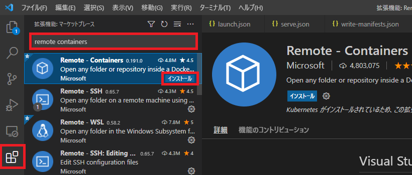
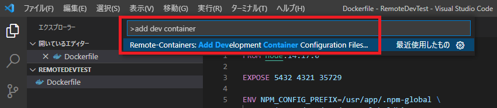
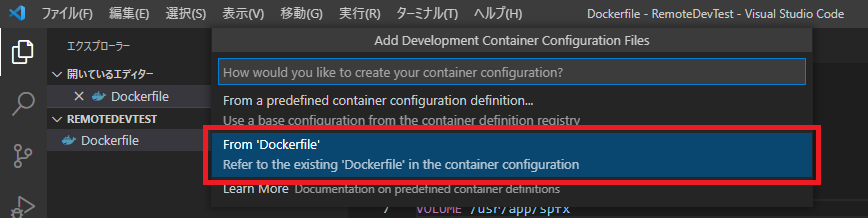
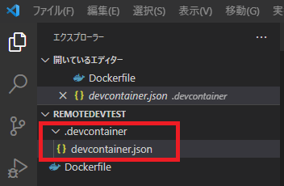
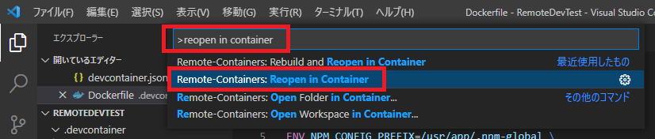
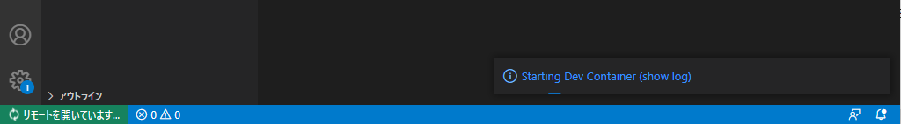
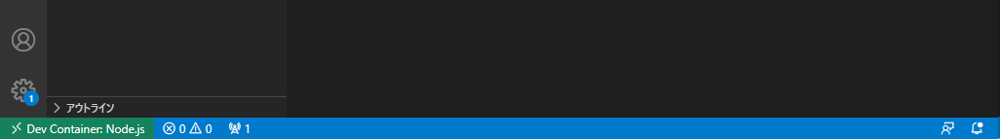
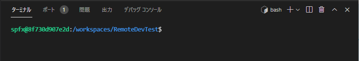

# はじめに

SharePoint Framework 開発環境に Docker を利用することによる利点は数多くありますが、プロジェクト作成後に Docker を使うための事前作業を行う必要がありました。
この事前作業が SharePoint Framework のバージョンによって異なったりするため、かなり骨の折れる作業でした。
ここまで手間をかけてまで Docker を使う必要があるのか・・・と悩んだりもしましたが、ここにきて良い解決策が見つかりました！
それが今回紹介する Visual Studio Code の拡張機能である「Remote- Containers」です。
この拡張機能を使うことで Docker を使うための煩わしい事前作業を無くすことができるため、Docker を使った SharePoint Framework 開発環境がこれまでよりも簡単に構築できるようになります。
より手軽に Docker の恩恵が受けられるようになるので、複数人開発や複数環境向けの開発を行っている場合は、ぜひこの拡張機能を利用してみてください。
この記事では、Remote - Containers と Docker を使った SharePoint Framework 開発環境構築の手順を説明します。

# 前提条件

- OS
  - Windows:  Windows 10
  - Mac:  macOS 10.9 以降
  - Linux:  Ubuntu、Debian、Red Hat、Fedora、SUSE
- [Visual Studio Code](https://code.visualstudio.com/)
- Docker
  - Windows:  Windows 10 Pro/Enterprise では [Docker Desktop](https://www.docker.com/products/docker-desktop) 2.0 以降。Windows 10 Home (2004 +) では、Docker Desktop 2.3 以降と [WSL 2 バックエンド](https://aka.ms/vscode-remote/containers/docker-wsl2)が必要。
  - Mac:  [Docker Desktop](https://www.docker.com/products/docker-desktop) 2.0 以降。
  - Linux:  [Docker CE/EE](https://docs.docker.com/install/#supported-platforms) 18.06 以降と [Docker Compose](https://docs.docker.com/compose/install) 1.21 以降。

なお、この記事では Windows 10 を使用する前提で進めます。

# 事前準備

## Remote - Containers 拡張機能のインストール

1. Visual Studio Code のアクティビティバーの拡張機能アイコンをクリックします。
2. 検索ボックスに「remote containers」と入力します。
3. "Remote - Containers" の [インストール] ボタンをクリックします。
   

## Dockerfile の準備

SharePoint Framework の開発環境に必要な nodejs、gulp、yo などのパッケージをインストールしたイメージを作成するための Dockerfile を準備します。
SharePoint Framework v1.12.1 の場合の例：
```
FROM node:14.17.0
EXPOSE 5432 4321 35729
ENV NPM\_CONFIG\_PREFIX=/usr/app/.npm-global \
PATH=$PATH:/usr/app/.npm-global/bin
VOLUME /usr/app/spfx
WORKDIR /usr/app/spfx
RUN useradd --create-home --shell /bin/bash spfx && \
usermod -aG sudo spfx && \
chown -R spfx:spfx /usr/app
USER spfx
RUN npm i -g gulp@4 yo @microsoft/generator-sharepoint@1.12.1
CMD /bin/bash
```
なお、Dockerfile は私が SharePoint Framework のバージョンごとに作成して GitHub にアップしているので、良かったら使ってみてください。
[HiroakiOikawa/docker-spfx: Docker Image for SharePoint Framework (github.com)](https://github.com/HiroakiOikawa/docker-spfx)

# プロジェクトごとに行う環境構築手順

ここからは、プロジェクトを作成する度に必要となる手順を記載します。

## ソースファイル格納先フォルダの作成

プロジェクトのソースファイルを格納するフォルダをローカルストレージ上に作成します。
ここでは「D:\Workspaces\RemoteDevTest」とします。

## Visual Studio Code でのコンテナの準備

事前準備で作成した Dockerfile をソースファイル格納先フォルダに保存します。
次に、Visual Studio Code を起動してソースファイル格納先フォルダを開いた後、以下の手順でコンテナを作成するための準備をします。

1. コマンドパレットを開きます。
2. コマンドパレットに「add dev container」と入力します。
3. [Remote - Containers: Add Development Container Configuration Files]を選択します。
   

続いて、既存の Dockerfile からコンテナを作成するためのオプション [From 'Dockerfile'] を選択します。

以上の設定を終えることで、「.devcontainer」フォルダ内にコンテナの情報を定義する「devcontainer.json」ファイルが作成されます。


## Dockerfile ファイルの移動（任意）

ここまでの状態のままでも特に支障はないのですが、Dockerfile を .devcontainer フォルダ配下に移動することをお勧めします。
今回は既存の Dockerfile を使用するようにしていますが、Dockerfile を Remote - Containers 拡張機能のオプションで自動作成する場合、Dockerfile は .devcontainer フォルダ配下に作成されます。
この動作に合わせて、既存の Dockerfile を使用する場合も、.devcontainer フォルダ配下に移動した方が分かりやすくなるのではないかと思います。
Dockerfile の場所を移動した場合、devcontainer.json ファイルの修正が必要となります。
devcontainer.json ファイルには Dockerfile のパスが相対パスで記載されているため、これを修正します。
修正箇所

- 10行目：「../」を削除

変更前の devcontainer.json
```
// For format details, see https://aka.ms/devcontainer.json. For config options, see the README at:
// https://github.com/microsoft/vscode-dev-containers/tree/v0.187.0/containers/docker-existing-dockerfile
{
"name": "Existing Dockerfile",
// Sets the run context to one level up instead of the .devcontainer folder.
"context": "..",
// Update the 'dockerFile' property if you aren't using the standard 'Dockerfile' filename.
"dockerFile": "../Dockerfile",
// Set \*default\* container specific settings.json values on container create.
"settings": {},
// Add the IDs of extensions you want installed when the container is created.
"extensions": []
// Use 'forwardPorts' to make a list of ports inside the container available locally.
// "forwardPorts": [],
// Uncomment the next line to run commands after the container is created - for example installing curl.
// "postCreateCommand": "apt-get update && apt-get install -y curl",
// Uncomment when using a ptrace-based debugger like C++, Go, and Rust
// "runArgs": [ "--cap-add=SYS\_PTRACE", "--security-opt", "seccomp=unconfined" ],
// Uncomment to use the Docker CLI from inside the container. See https://aka.ms/vscode-remote/samples/docker-from-docker.
// "mounts": [ "source=/var/run/docker.sock,target=/var/run/docker.sock,type=bind" ],
// Uncomment to connect as a non-root user if you've added one. See https://aka.ms/vscode-remote/containers/non-root.
// "remoteUser": "vscode"
}
```
変更後の devcontainer.json
```
// For format details, see https://aka.ms/devcontainer.json. For config options, see the README at:
// https://github.com/microsoft/vscode-dev-containers/tree/v0.187.0/containers/docker-existing-dockerfile
{
"name": "Existing Dockerfile",
// Sets the run context to one level up instead of the .devcontainer folder.
"context": "..",
// Update the 'dockerFile' property if you aren't using the standard 'Dockerfile' filename.
"dockerFile": "Dockerfile",
// Set \*default\* container specific settings.json values on container create.
"settings": {},
// Add the IDs of extensions you want installed when the container is created.
"extensions": []
// Use 'forwardPorts' to make a list of ports inside the container available locally.
// "forwardPorts": [],
// Uncomment the next line to run commands after the container is created - for example installing curl.
// "postCreateCommand": "apt-get update && apt-get install -y curl",
// Uncomment when using a ptrace-based debugger like C++, Go, and Rust
// "runArgs": [ "--cap-add=SYS\_PTRACE", "--security-opt", "seccomp=unconfined" ],
// Uncomment to use the Docker CLI from inside the container. See https://aka.ms/vscode-remote/samples/docker-from-docker.
// "mounts": [ "source=/var/run/docker.sock,target=/var/run/docker.sock,type=bind" ],
// Uncomment to connect as a non-root user if you've added one. See https://aka.ms/vscode-remote/containers/non-root.
// "remoteUser": "vscode"
}
```
以上で Visual Studio Code Remote - Containers 拡張機能を使うための準備が整いました。

## プロジェクトをコンテナで開く

続いてこれから開発を進めるプロジェクトをコンテナ上で開きます。

1. コマンドパレットを開きます。
2. コマンドパレットに「reopen in container」と入力します。
   

すると Visual Studio Code が開き直されて下図のように画面下部のステータスバーに「リモートを開いています...」と表示されます。
なお、コンテナの初回接続時はコンテナがビルドされるため、接続されるまで数分かかることがありますので気長に待ちましょう。

その後、しばらくするとステータスバーの表示が「Dev Container: Node.js」に変わり、コンテナ上でプロジェクトが開かれた状態になります。

この状態でターミナルを開くと以下の通り bash シェルが起動した状態になっています。


## SharePoint Framework プロジェクトの作成

ここまでの手順により、プロジェクトをコンテナ上で開いて開発を始める準備ができたので、ここからは通常の SharePoint Framework プロジェクトの作成手順に入ります。
SharePoint Framework プロジェクトの作成手順については [docs](https://docs.microsoft.com/ja-jp/sharepoint/dev/spfx/web-parts/get-started/build-a-hello-world-web-part?WT.mc_id=M365-MVP-4012897) に詳細が載っているので参考にしてください。
とはいえ、分かりづらい部分もあるかと思いますので、Remote - Containers 拡張機能を使う前提での SharePoint Framework プロジェクトの作成手順を別記事でまとめたいと思います。
本当は過去に書いた記事が使えればよかったのですが、Remote - Containers 拡張機能は使わず直接 Docker を使う手順の一貫として SharePoint Framework プロジェクトの作成手順を書いていたため不要な手順なども含まれており、そちらの記事への参照で済ますという手法を断念しました。
ということで、この後執筆する別記事もご覧いただければと。
[AdSense-B]
