# はじめに

Teams のアプリバーにポータルサイトを開くアプリを追加する方法として、Viva Connections アプリを追加する方法があります。
しかし、この方法ではテナントで唯一無二の存在である SharePoint ホームサイトを開くことしかできません。
国ごとにポータルサイトが分かれている会社やグループ企業で単一テナントを使っていて各社のポータルサイトが分かれている場合、Viva Connections アプリを追加する方法では各社のポータルサイトを直接開くことができないため、ニーズを満たすことができないということになります。
この問題を解決する方法を紹介します。

# Teams のアプリバーにポータルサイトを開くアプリを追加する

Teams のアプリバーには Microsoft の Teams アプリストアのアプリだけでなく、組織のアプリカタログのアプリを追加することができます。
組織のアプリカタログには独自のアプリを追加することができるため、結果的に Teams のアプリバーには組織独自のアプリが追加できるということになります。
下図は、組織のアプリカタログに追加した会社のポータルサイトを開くためのアプリをアプリバーに追加した状態です。
[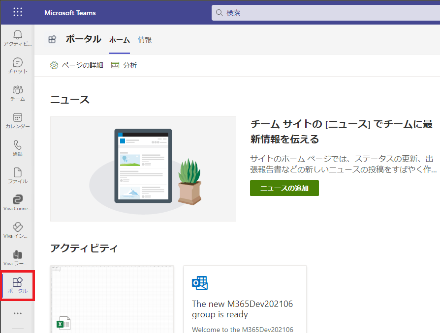](/wp-content/uploads/2022/04/appstudio3-3.png)
アプリバーに追加されたアイコンをクリックすることで Teams の中にポータルサイトを開くことができます。
Teams のタブとしてポータルサイトを追加することもできますが、アプリバーに追加した方がより簡単にポータルサイトを開くことができ便利かと思います。
結果的に、Viva Connections アプリを追加するのと同じ効果(アイコンをクリックしたらポータルサイトが開く)が得られることになります。

# 前提条件

今回の設定を行うための前提条件として、Teams のカスタムアプリの登録が許可されている必要があります。
この許可設定は Teams 管理センターにて行います。
Teams 管理センターのメニューから、[Teams のアプリ] > [セットアップポリシー] をクリックし、[カスタムアプリをアップロード] の設定を「オン」にします。
設定反映まで数分かかるので、この設定は事前に行っておきましょう。
[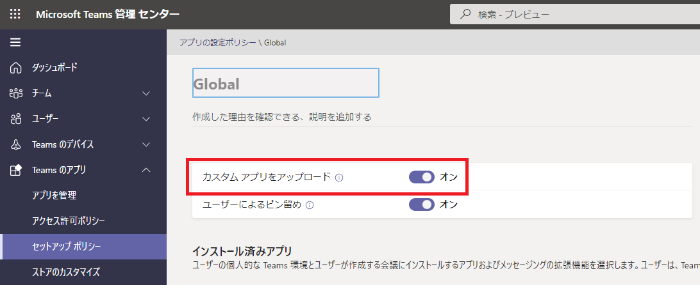](/wp-content/uploads/2022/04/appstudio2-1.png)

# 手順

## App Studio アプリを追加する

独自アプリを Teams で使えるようにするには、まずはアプリの定義ファイルを作成します。
Teams アプリバーの [...] をクリックし、「App Studio」アプリを探してクリックします。
[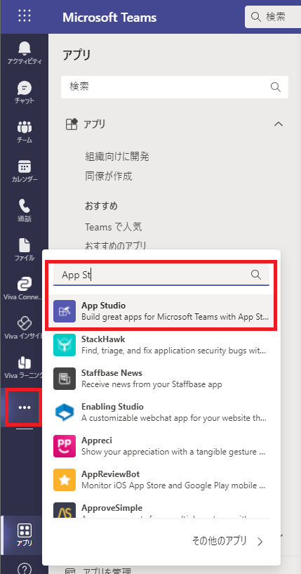](/wp-content/uploads/2022/04/appstudio1.png)
App Studio アプリの追加ダイアログが開くので [追加] ボタンをクリックします。
[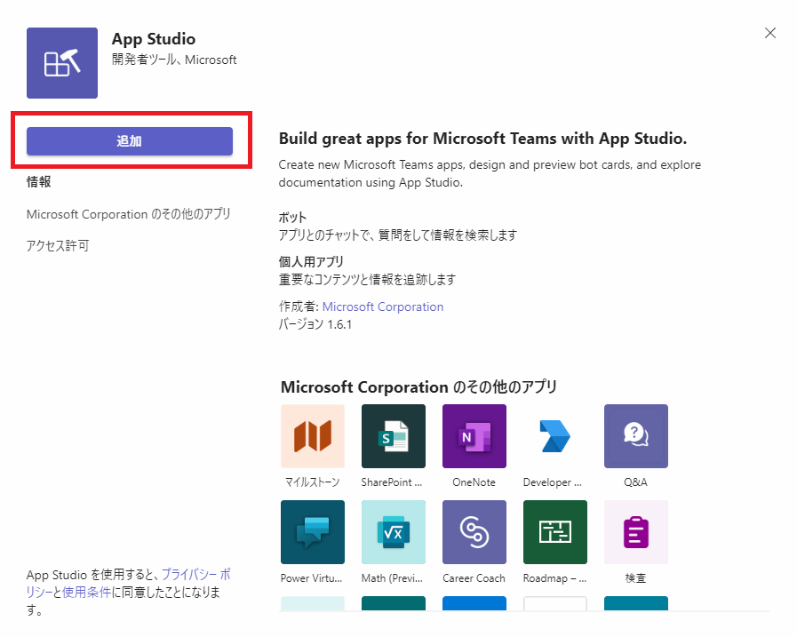](/wp-content/uploads/2022/04/appstudio2.png)

## アプリの定義ファイル(マニフェストファイル)を作成する

App Studio アプリを開き、[Create a new app] をクリックします。
[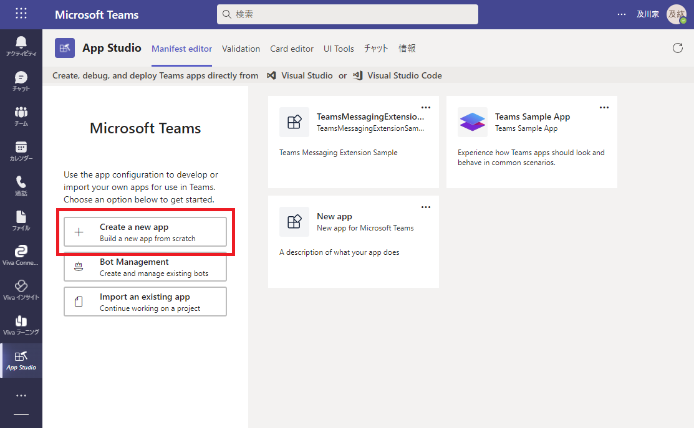](/wp-content/uploads/2022/04/appstudio3.png)
マニフェストの登録画面が表示されるので、各項目を入力します。
入力時のポイントを記載します。
Details - App details
・App names - Short name　→ アプリバーに表示される名前を指定します。
・Identification - App ID　→ [Generate] ボタンをクリックし App ID を自動入力します。
Capabilities - Tabs
・Add a personal tab　→ [Add] ボタンをクリックしパーソナルタブアプリの設定ダイアログを開きます。
Personal tab ダイアログ
・Name　→ アプリを開いた際にアプリ名の右隣に表示する名称。Teams のチャネル名に相当します。
・Content URL　→アプリをクリックした際に表示されるポータルサイトのURLを入力します。

## アプリをテストする

マニフェストの各項目の入力を終えた後、Finish セクションの Test and distribute メニューからテストのための準備を行います。
[Install] ボタンをクリックすることで自分自身の Teams にアプリを追加してテストすることができます。
[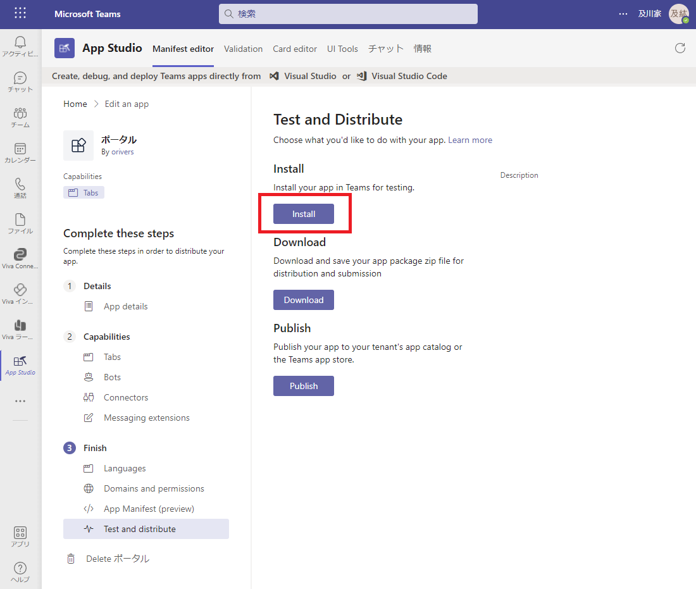](/wp-content/uploads/2022/04/appstudio3-1.png)
[Install] ボタンをクリックするとアプリの詳細ダイアログが表示されるので [追加] ボタンをクリックします。
[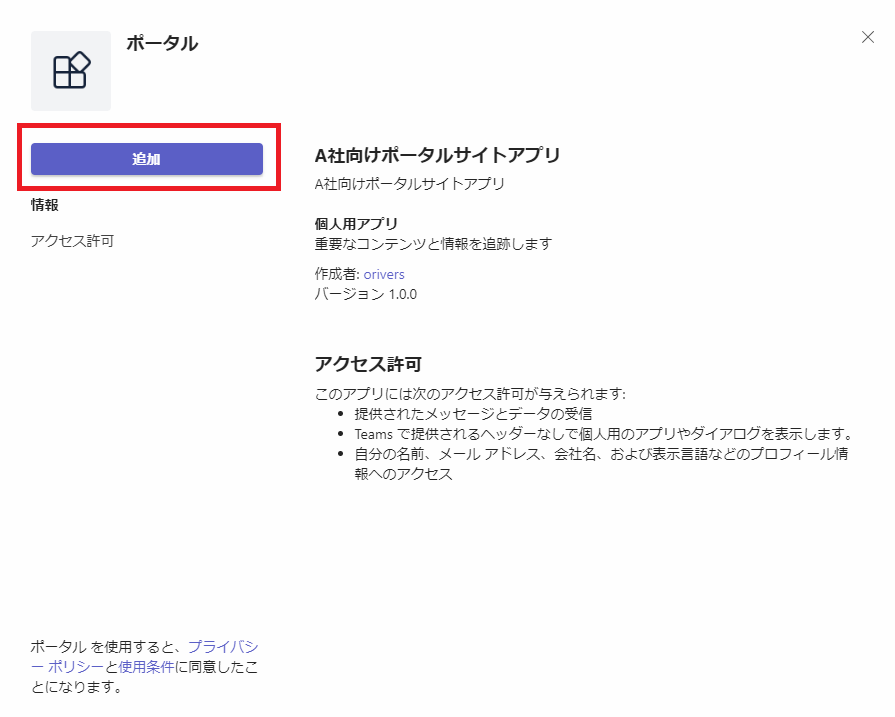](/wp-content/uploads/2022/04/appstudio3-2.png)
追加が完了するとアプリバーに追加したアプリの Short name が付いたアイコンが表示され、Content URL で指定したページが右側に表示されます。
見て分かる通り、SharePoint ページのヘッダーは表示されず、タブとして Personal tab で Name に指定したタブとデフォルトで追加されている情報タブが表示されます。

また、サイトが開いている状態でもう一度追加したアプリのボタンをクリックすると、Viva Connections アプリのボタンをクリックした時と同様に SharePoint ホームサイトで指定したグローバルナビゲーションと個人用サイト、自分のニュースが表示されます。
[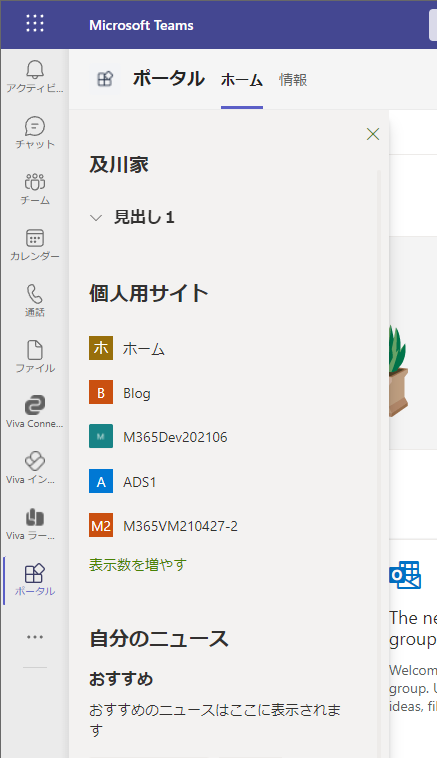](/wp-content/uploads/2022/04/appstudio3-4.png)

## 組織のアプリカタログにアプリを追加する

テストを終えた後、Finish セクションの Test and distribute メニューから公開作業を行います。
[Publish] ボタンをクリックすることで組織のアプリカタログにアプリを追加する作業を開始します。
[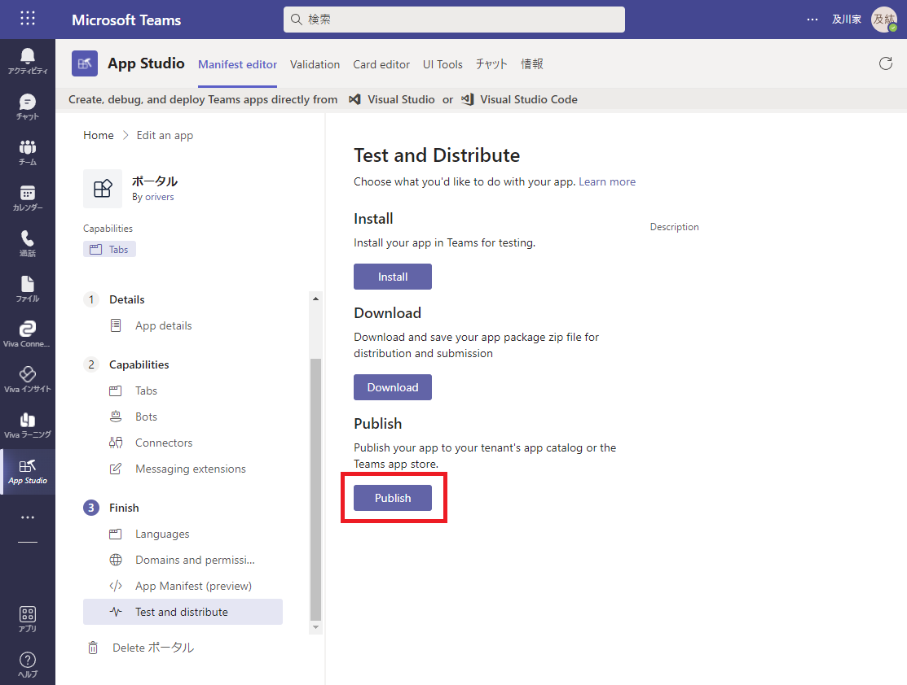](/wp-content/uploads/2022/04/appstudio4.png)
[Publish ..... app catalog] をクリックします。
[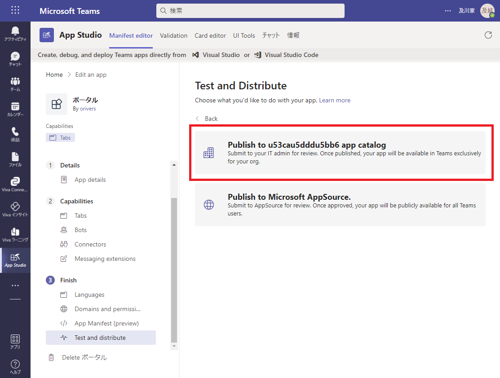](/wp-content/uploads/2022/04/appstudio5.png)
[Submit] ボタンをクリックします。
これで組織のアプリカタログにアプリを追加することができました。
[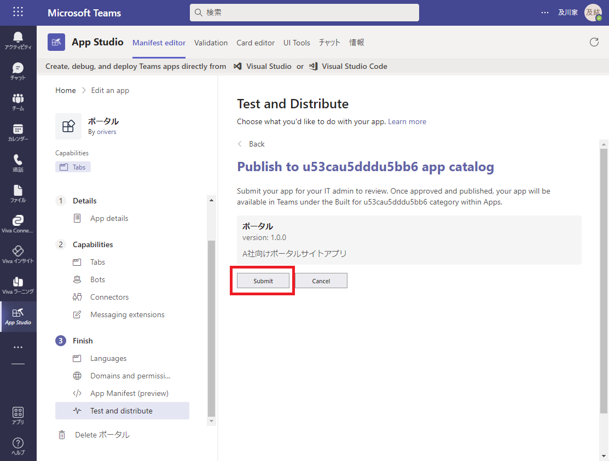](/wp-content/uploads/2022/04/appstudio6.png)

## アプリを公開する

Teams 管理センターを開き、メニューから [Teams のアプリ] > [アプリを管理] をクリックし、アプリの管理ページを開きます。
[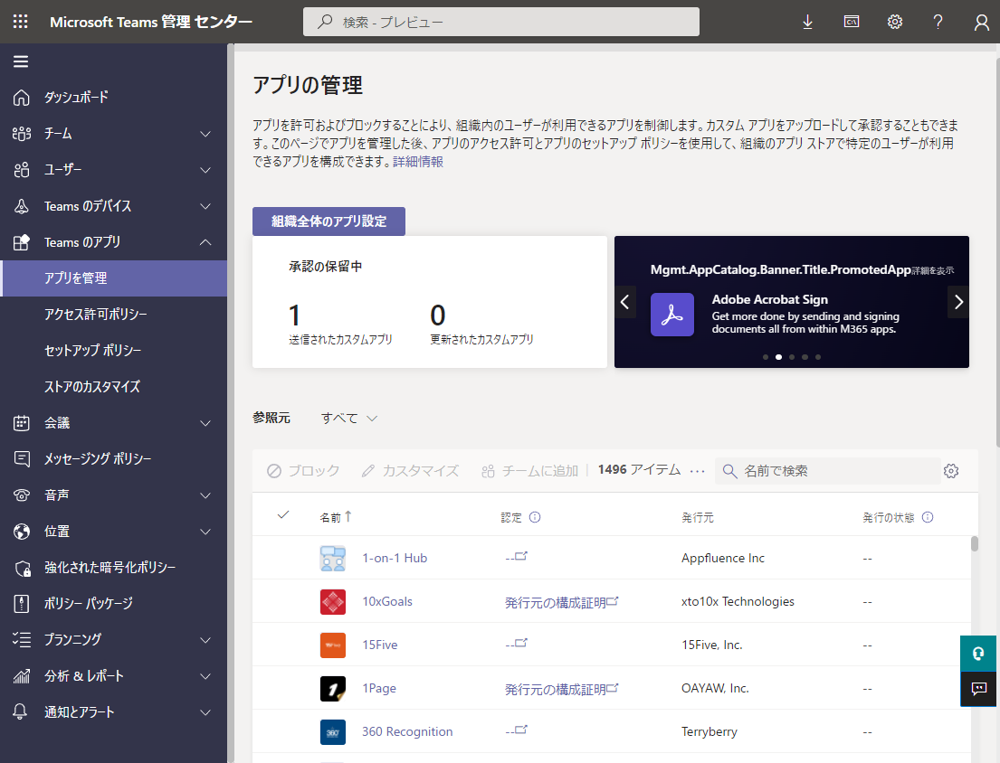](/wp-content/uploads/2022/04/appstudio7.png)
[参照元] の一覧から追加したアプリを検索します。
検索ボックスにはマニフェストファイルを作成する際に入力した Short name の値を入力してください。
アプリが検索できたら一覧からアプリの名前をクリックします。
[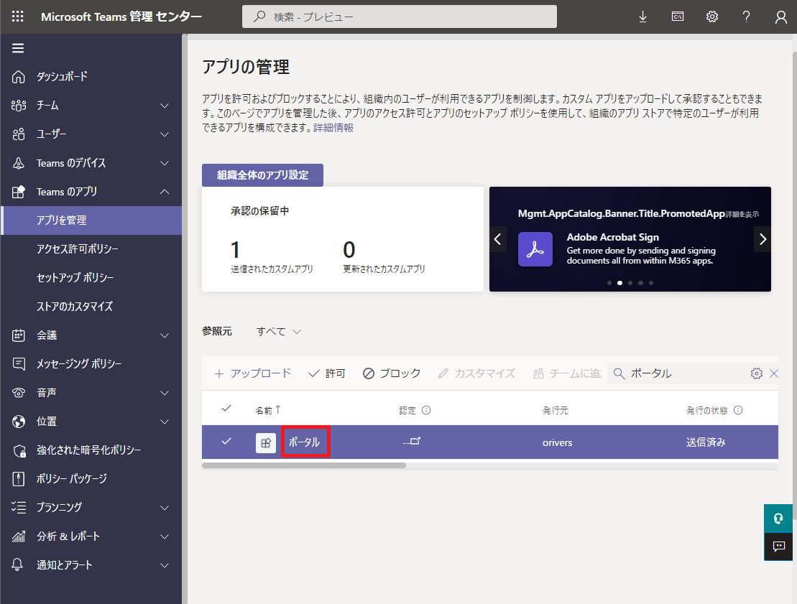](/wp-content/uploads/2022/04/appstudio8.png)
アプリの詳細ページにて、[Publish] ボタンをクリックし、続いて表示されるダイアログで [公開] ボタンをクリックします。
これでアプリが公開されユーザーが使用できる状態になりました。
[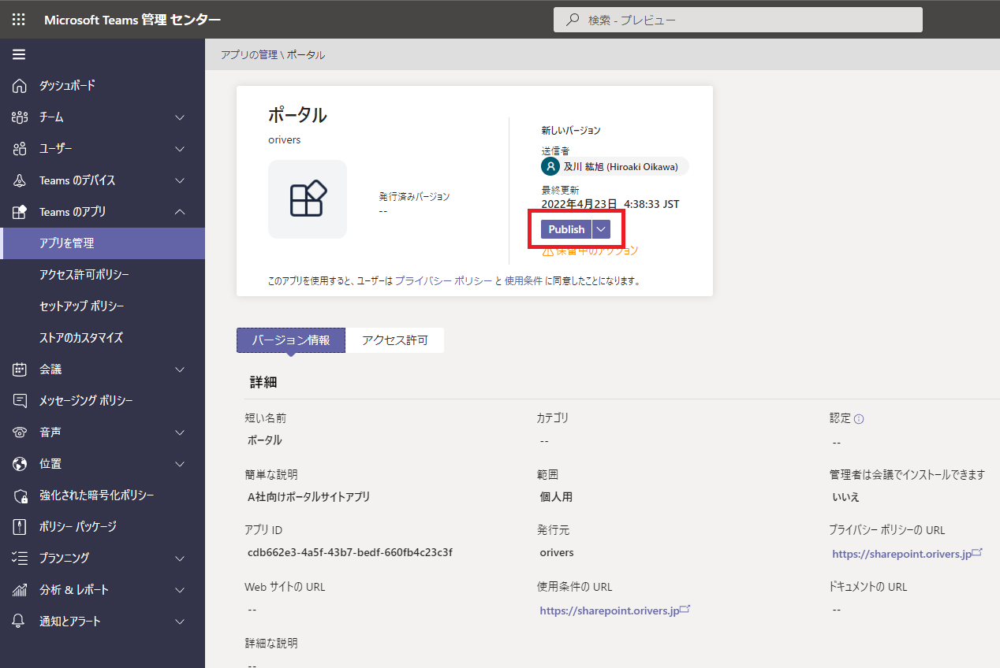](/wp-content/uploads/2022/04/appstudio9.png)

# この後の手順

これでユーザーは他の Teams アプリと同様に今回作成したアプリを自分で追加することができます。
ここまででも良いのですが、例えば自分が所属する会社のポータルサイトアプリが自動的に Teams に追加されていればより便利に使えますよね。
この対応を行う手順も準備したいと思いますが記事が長くなるので別記事で。
[AdSense-B]
