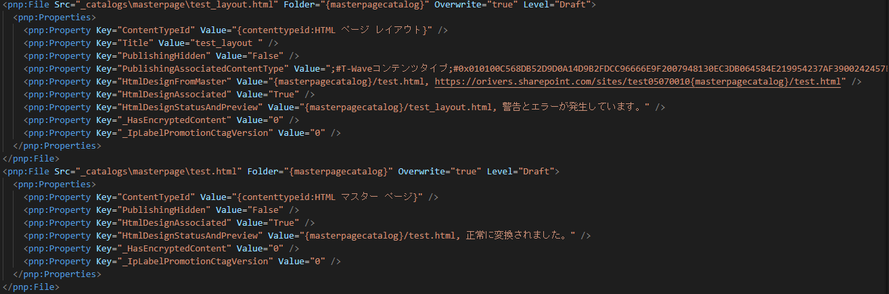

# はじめに

[PnP Provisioning](https://docs.microsoft.com/ja-jp/sharepoint/dev/solution-guidance/introducing-the-pnp-provisioning-engine?WT.mc_id=M365-MVP-4012897) を使って、クラシックサイトのマスターページとページレイアウトを SharePoint Online サイトに展開する方法を調査しました。
想像していたのとは違う形になってしまったので、展開方法を残しておきたいと思います。
なお、PnP Provisioning は日々進化しているオープンソースのライブラリのため、ここでの検証結果が未来永劫有効なものではないということをご了承ください。
2022年5月6日時点のコードで検証しています。

# 普通にテンプレート化してもダメ

[Get-PnPSiteTemplate](https://pnp.github.io/powershell/cmdlets/Get-PnPProvisioningTemplate.html) コマンドレットで PnP サイトテンプレートを作成すればマスターページもページレイアウトもテンプレートに含まれるだろうと思っていたのですが、それだけではうまく行きませんでした。
試したことは、Get-PnPSiteTemplate コマンドレットで .pnp 形式のファイルを出力させ、これを [Invoke-PnPSiteTemplate](https://pnp.github.io/powershell/cmdlets/Invoke-PnPSiteTemplate.html) コマンドレットで展開する方法です。
.pnp 形式のテンプレートは無事作成することができ、.pnp ファイルの拡張子を .zip に変更し解凍することでマスターページファイル(.master)が含まれていることも確認したのですが、この方法では .pnp ファイルにページレイアウトが含まれませんでした。
試しに Invoke-PnPSiteTemplate コマンドレットを実行するも、マスターページファイルは展開されるもののマスターページとしては認識されず・・・
そしてもちろんページレイアウトも展開されませんでした。
色々オプションを付けてもうまく行かなかったため、この方法は諦めました。

# マスターページ、ページレイアウトを別で展開する方法

Invoke-PnPSiteTemplate コマンドレットでうまく行かなかったので、PnP サイトテンプレートにマスターページ、ページレイアウトは含めず、個別に展開する方法を試しました。
これが結果的にうまく行った方法になります。

## PnP サイトテンプレート作成

PnP サイトテンプレートは .pnp 形式ではなく .xml 形式で作成しました。
```
Connect-PnPOnline `
-Url $SiteUrl1 `
-Interactive
Get-PnPSiteTemplate `
-Out .\site-template-pnp.xml `
-Config .\site-template-pnp-config.json
```
PnP サイトテンプレート作成後、File タグの中からマスターページとページレイアウトのタグを見つけ削除しました。（以下コードをすべて削除しました）
[](/wp-content/uploads/2022/05/PnPPublishing-1.png)

## サイトへの展開

サイトにマスターページとページレイアウトを展開する際には、Invoke-PnPSiteTemplate コマンドレットを実行するだけでなく、[Add-PnPMasterPage](https://pnp.github.io/powershell/cmdlets/Add-PnPMasterPage.html) コマンドレットと [Add-PnPPublishingPageLayout](https://pnp.github.io/powershell/cmdlets/Add-PnPPublishingPageLayout.html) コマンドレットも使用しました。
Add-PnPMasterPage コマンドレットと Add-PnPPublishingPageLayout コマンドレットの使用にあたっては、事前にマスターページファイル(.master)とページレイアウトファイル(.aspx)をテンプレートサイトのマスターページギャラリーからダウンロードしておく必要がありますので忘れずに。
以下、サイトに PnP サイトテンプレートを適用したあと、マスターページ、ページレイアウトを展開するコマンドになります。
(ページレイアウトはアーティクルページのコンテンツタイプに関連付けています)
```
Connect-PnPOnline `
-Url $SiteUrl `
-Interactive
Invoke-PnPSiteTemplate `
-Path .\site-template-pnp.xml
Add-PnPMasterPage `
-SourceFilePath .\test.master `
-Title test `
-Description test
Add-PnPPublishingPageLayout `
-SourceFilePath .\test\_layout.aspx `
-Title test\_layout `
-Description testlayout `
-AssociatedContentTypeID 0x010100C568DB52D9D0A14D9B2FDCC96666E9F2007948130EC3DB064584E219954237AF3900242457EFB8B24247815D688C526CD44D
```
もしかしたらもっと良いやり方があるのかもしれませんが、これでもできますので必要な時が来たら参考にしてみてください。
って、もうなかなか必要な時は無いと思いますが。。。
