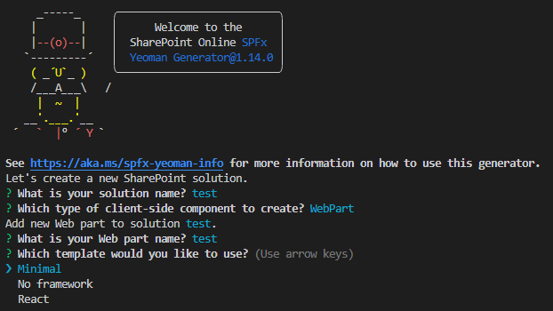
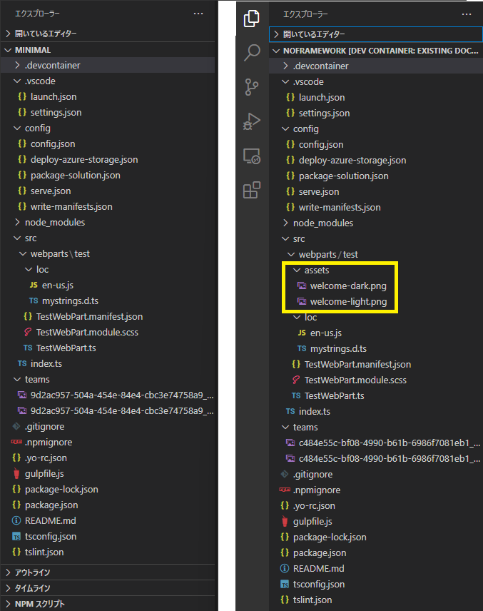

# はじめに

SharePoint Framework で Web パーツプロジェクトを作成する際に指定するテンプレートの選択肢には SharePoint Framework V1.14 時点で「Minimal」「No framework」「React」の 3 種類があります。

React はその名の通り React のライブラリを組み込んだプロジェクトが出来上がるのですが、Minimal と No framework の違いが分からないので調べてみました。

# Minimal と No framework の比較

No framework は SharePoint Framework ができた当初から存在するオプションでしたが、Minimal は最近追加されたものになります。
この二つの違いを調べるために、プロジェクトの生成時間、生成されたファイルの合計サイズ、ファイル数を調べてみました。
結果がこちら。

|  |  |  |  |
| --- | --- | --- | --- |
| テンプレート | 生成時間 | ファイルサイズ | ファイル数 |
| Minimal | 192 秒 | 598 MB | 60,801 |
| No framework | 184 秒 | 598 MB | 60,803 |

あれ・・・全然変わらないですね。
生成時間は逆転してますが、まぁ、誤差の範囲ですね。
これでは何が変わったのか分からないので生成されたソースも見てみました。
左が Minimal、右がNo framework です。

違いは、黄色枠箇所の assets フォルダの有無だけでした。
assets フォルダ内の png ファイルは、No framework で作成された際にデフォルトで作られるサンプルプログラムの中で読み込まれている画像ファイルです。
Minimal にこれのファイルが無いのは、Mnimal だとサンプルプログラムが生成されないためのようです。
 
続いて主要なファイルの中身を比較してみました。
結果、ファイルの中で違っていたのは以下のファイルでした。

- src\webparts\{プロジェクト名}\loc\en-us.js
- src\webparts\{プロジェクト名}\loc\mystrings.d.ts
- src\webparts\{プロジェクト名}\{プロジェクト名}WebPart.module.scss
- src\webparts\{プロジェクト名}\{プロジェクト名}WebPart.ts

違いとしては、WebPart.ts 内のコードの違いで、Minimal の場合は本当に最小限のコードしか生成されていませんでしたが、No framework はサンプルプログラムとして以下の実装がされていました。

- サンプル HTML の出力
- リソースファイルの読み込み
- SharePoint、Teams のどちらで動いているかの判定
- テーマに応じたダークモードへの切り替え
- プロパティパネル対応

 
ということで、現時点では全然違いはありませんでした。
どちらでも好きな方を使いましょう。
