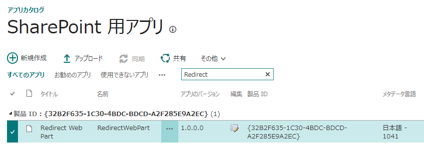
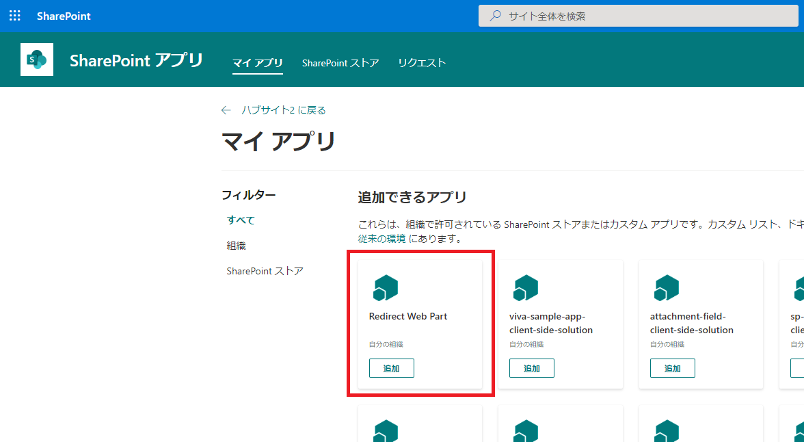
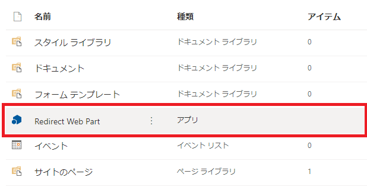
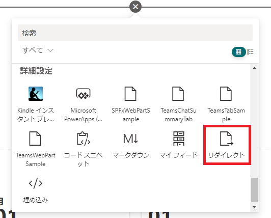
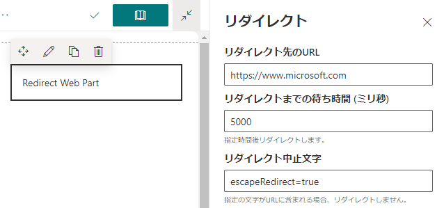

# はじめに

SharePoint のモダンサイトで使える、リダイレクト Web パーツを [GitHub](https://github.com/HiroakiOikawa/spfx-sample/tree/master/RedirectWebPart) に公開しました。
ソースコードをそのまま公開しているので、興味ある方は是非中身を確認してみてください。
全然コードは書いてないので SharePoint Framework で開発した Web パーツのサンプルとしてちょうど良いかと思います。
この記事ではソースコードの中身の話ではなく、リダイレクト Web パーツのインストールの仕方と使い方について解説したいと思います。

# インストール

リダイレクト Web パーツのパッケージファイル(RedirectWebPart.sppkg)を[ここからダウンロード](https://sharepoint.orivers.jp/download/%e3%83%aa%e3%83%80%e3%82%a4%e3%83%ac%e3%82%af%e3%83%88-web-%e3%83%91%e3%83%bc%e3%83%84)し、インストール先テナントのアプリカタログサイトにアップロードしてください。

続いて、リダイレクト Web パーツを使用したいサイトにて、アプリの追加からリダイレクト Web パーツを追加します。

サイトコンテンツの一覧上に「Redirect Web Part」が表示されればインストール完了です。

# 設定方法

リダイレクト設定を行いたいページに、リダイレクト Web パーツを配置します。

続いて、Web パーツのプロパティを設定します。
各プロパティの説明は以下を参照ください。

- **リダイレクト先のURL**
  リダイレクト Web パーツを置いたページを開いた際のリダイレクト先の URL を指定します。
- **リダイレクトまでの待ち時間(ミリ秒)**
  リダイレクト Web パーツを置いたページを開いた後、何ミリ秒経ってからリダイレクトするかを指定します。
  ブランクの場合は即時リダイレクトします。
- **リダイレクト中止文字**
  URL の中にこの値が含まれている場合、リダイレクトしなくなります。
  デフォルトでは「escapeRedirect=true」となっており、URL が例えば https://hoge.sharepoint.com/sites/hoge?escapeRedirect=true のようになっているとリダイレクトされなくなります。

リダイレクト Web パーツはページ編集中は「Redirect Web Part」と画面上に表示されリダイレクト処理はされません。
編集が完了すると「Redirect Web Part」という文字は表示されなくなり、リダイレクト処理が実行されるようになります。
編集完了状態でリダイレクト処理を中止したい場合は、リダイレクト中止文字で指定した文字を URL に含めてアクセスするようにしてください。
ただリダイレクトするだけのパーツなので使いどころは限られるかと思いますが、良かったら使ってみてください。
