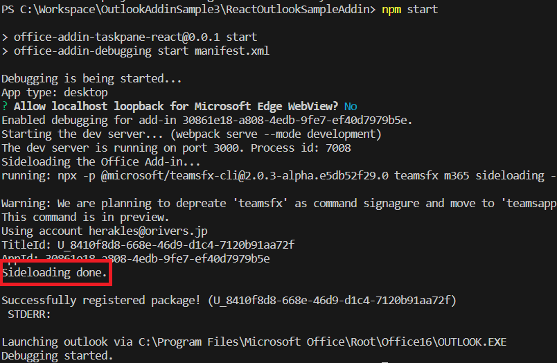
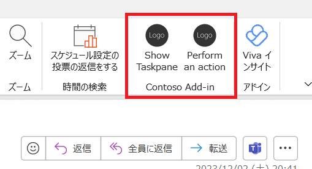
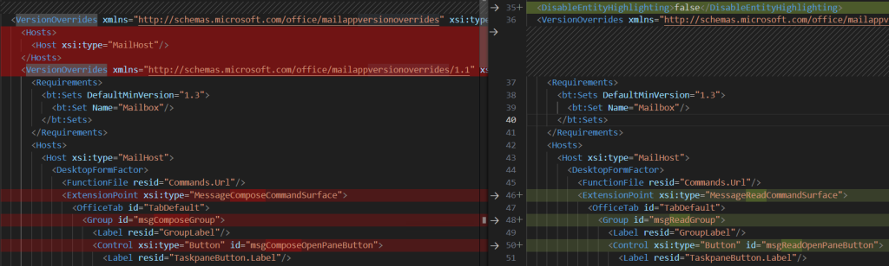
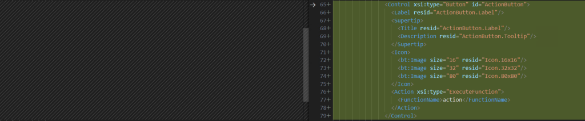
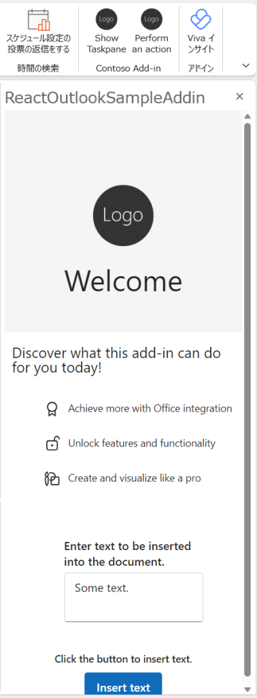
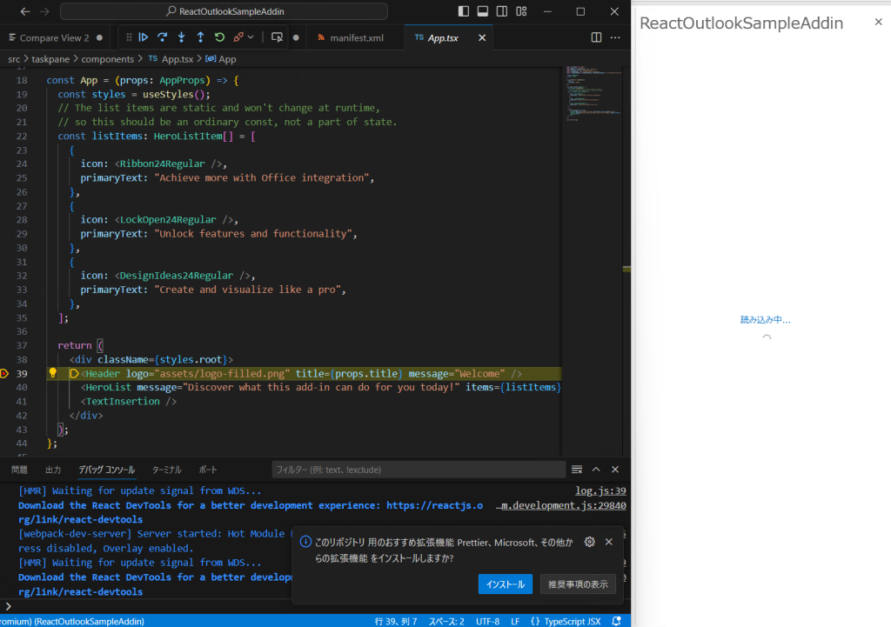

## はじめに

つい先日まで普通に動かすことができていたはずの React を利用した Outlook アドインが、翌日から突然デバッグできなくなってしまった件について、調べたことをまとめました。

## 開発環境

OS：Hyper-V上のWindows 11 23H2
Visual Studio Code：1.84.2
Node.JS：20.10.0
Outlook：Microsoft 365 Apps for enterprise

## 事象

[docs に記載の流れ](https://learn.microsoft.com/ja-jp/office/dev/add-ins/quickstarts/outlook-quickstart?tabs=yeomangenerator)に従い、`yo office` でプロジェクトを作成。
プロジェクトの種類は「Office Add-in Task Pane project using React framework」を選択。
プロジェクト作成完了後、何もコードを変えずに `npm start` を実行。
これで、嵌る前日(2023年11月20日)までは特に問題なく動作していた記憶があるのに、翌日新規で環境を作って同じようにプロジェクトを作ってみたら「Sideloading done.」と表示されているのに、Outlook上にはアドインが表示されなくなってしまいました。

## 原因

結論、React で作るアドインの方にマニフェストファイルに問題がありました。
試しに React を使わない、素の JavaScript を使ったテンプレートでプロジェクトを作り npm start を実行してみたところ、期待通りアドインがサイドロードされて、Outlook 上にもアドインが表示されました。

React を使わない場合はうまく動くことが分かったので、両者のマニフェストファイルを比較したところいくつか異なる点があったのですが、特に以下の2つが大きく違いました。

一つ目、React 版は VersionOverrides タグが、1.0 のものと 1.1 のものの二つありました。
※左が React 版、右が JavaScript 版のマニフェストファイル

二つ目、React 版は作業ウィンドウを開くボタンの定義は組み込まれていますが、カスタムボタンの定義が組み込まれていませんでした。
※左が React 版、右が JavaScript 版のマニフェストファイル

ということで、JavaScript 版で生成されたマニフェストファイル(manifest.xml)を React 版のプロジェクトの方にコピペした上で、`npm start` を行ったところ、無事アドインが表示されデバッグ実行ができるようになったことを確認できました。

## まとめ

今回なぜ突然デバッグできなくなってしまったのか、マニフェストが変わってしまったのかは分かりませんが、アドインが表示されない問題はマニフェストファイルによるところが大きいので、同じようなことが起きた場合に参考にしていただければと思います。

## 参考

- [最初の Outlook アドインをビルドする - Office Add-ins | Microsoft Learn](https://learn.microsoft.com/ja-jp/office/dev/add-ins/quickstarts/outlook-quickstart?tabs=yeomangenerator)
- [Outlook アドインのアクティブ化ルール - Office Add-ins | Microsoft Learn](https://learn.microsoft.com/ja-jp/office/dev/add-ins/outlook/activation-rules)
- [Outlook コンテキスト アドインのアクティブ化のトラブルシューティング - Office Add-ins | Microsoft Learn](https://learn.microsoft.com/ja-jp/office/dev/add-ins/outlook/troubleshoot-outlook-add-in-activation)
- [テスト用に Outlook アドインをサイドロードする - Office Add-ins | Microsoft Learn](https://learn.microsoft.com/ja-jp/office/dev/add-ins/outlook/sideload-outlook-add-ins-for-testing?tabs=windows)
