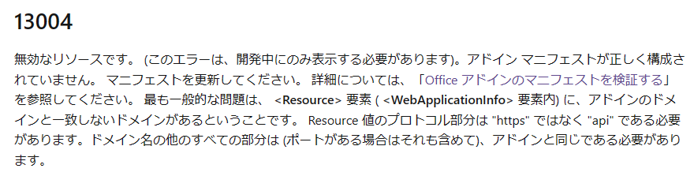

## はじめに

Outlook アドインの開発がローカル環境で一区切りついたので、テスト環境にデプロイするためにマニフェストファイルを変更したら、ドツボにはまってしまった件についてまとめてみました。

## 開発環境

OS：Hyper-V上のWindows 11 23H2
Visual Studio Code：1.84.2
Node.JS：20.10.0
Outlook：Microsoft 365 Apps for enterprise

## 事象

ローカルでの開発時は、マニフェストファイルの SourceLocation タグで指定する URL はデフォルトで以下になっています。
`https://localhost:3000/taskpane.html`

テスト環境にデプロイするにあたっては、localhost のままではダメなので、Azure 上に用意した Web サイトにデプロイするため、こちらの手順([Visual Studio Code と Azure を使用してアドインを発行する - Office Add-ins | Microsoft Learn](https://learn.microsoft.com/ja-jp/office/dev/add-ins/publish/publish-add-in-vs-code))に従って、SourceLocation タグで指定する URL を以下に変更しました。
`https://aaaa.bbbb.ccc/taskpane.html`

マニフェストファイルの検証(`npm run validate`)も無事完了したので、テスト環境の Outlook デスクトップクライアントにマニフェストファイルをサイドロードしてみるも失敗！

まともなエラーメッセージも表示されず、マニフェストの検証もエラーが無かったため手がかりが見つからず、調査に非常に時間がかかってしまいました。

## 原因

結論、マニフェストファイル内の WebApplicationInfo タグ配下の Resource タグの値と、SourceLocation タグの値を一致させる必要があることが分かりました。

WebApplicationInfo タグの説明はこちら。
Outlook アドインで SSO を利用する場合に設定するタグになります。
[マニフェスト ファイルの WebApplicationInfo 要素 - Office Add-ins | Microsoft Learn](https://learn.microsoft.com/ja-jp/javascript/api/manifest/webapplicationinfo?view=common-js-preview)

この説明を読んでも上記の原因は全く想像もつかなかったのですが、色々調べていたらこちらのページに行きつきました。
[[シングル サインオン (SSO) のエラー メッセージのトラブルシューティング - Office Add-ins | Microsoft Learn](https://learn.microsoft.com/ja-jp/office/dev/add-ins/develop/troubleshoot-sso-in-office-add-ins)](https://learn.microsoft.com/en-us/office/dev/add-ins/develop/sso-in-office-add-ins)

実際には上記ページに記載のあるようなエラーメッセージは表示されていなかったのですが、マニフェストファイルの変更点を一つずつ遡ってはデプロイして・・・というのを繰り返していたところ、WebApplicationInfo タグの有無で問題が発生したりしなかったりすることが分かったので、WebApplicationInfo を手掛かりに検索をしていて上記情報が目に留まりました。
この中で Resource タグに関する情報が見つかり、以下のように記載がありました。

この情報から Resource タグの値は、アドインのドメインと一致しないといけないことが分かりました。

この情報を元に、AppDomain タグに Resource タグの値を入れてみましたがこれは効果なし。
結果的に、SourceLocation タグと Resource タグの値を一致させることで、無事マニフェストをテスト環境にインストールすることができました。

## まとめ

Outlook アドイン開発ではまるポイントの一つがこのマニフェストファイル関連です。
ネット検索してみるとマニフェストファイルではまっている人の情報が結構上がってきます。
それでも情報に行きつくのが難しいため解決に時間を要することになると思いますが、デフォルト状態のマニフェストファイルから何を変更したのかを確認し、その変更点が正しいかどうかを一つずつ確認していくことで何とか原因を探ることができるので、皆さん諦めずに行きましょう。

##
