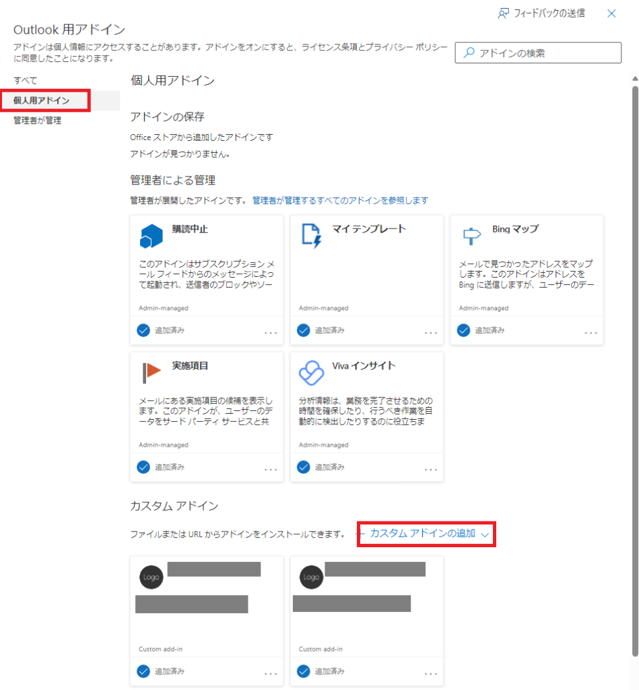

## はじめに

Outlookアドインの開発を行っていると、ある程度開発が進んだ段階で、開発で使用しているユーザー以外がアクセスする場合の試験など行うことになると思いますが、そうなるとカスタムアドインをOutlookに手動で登録する必要が出てきます。

この登録方法についてまとめました。

## カスタムアドイン追加の流れ

Outlookデスクトップクライアントを起動し、[ファイル]メニューをクリック。
[アカウント情報]パネルが開くので、[アドインの管理]ボタンをクリック。

ブラウザで[Outlook用アドイン]画面が開くので、[個人用アドイン]をクリックし、画面下部の[カスタム アドインの追加]ボタンをクリックしてカスタムアドインのマニフェストファイルを選択することで、カスタムアドインを追加できます。

## ショートカット

上記手順を踏めば、カスタムアドインを自分で追加できますが、テスト対象となるユーザーが複数いた場合にはユーザーを切り替えながら上記手順を踏む必要があるので結構面倒です。
Outlookデスクトップクライアントは使わず、ブラウザだけでできるようになれば多少は楽なんだけど。。。

ということで、一気に[Outlook用アドイン]画面を開くためのショートカットを掲載します。
これさえあれば、ブラウザでユーザー切替をしてショートカットを開くだけなので、デスクトップクライアントを利用する手間が省けて、気持ち、多少楽になります。
けど、その程度です笑

Outlook用アドイン画面のショートカット
<https://aka.ms/olksideload>

## 別のやり方

公式ではもう一つのやり方が紹介されています。
それは、Microsoft 365 管理センターの[統合アプリ]メニューになります。
ただ、こちらは管理センターにアクセスできなければならないので、開発者がデバッグや試験の段階で使うにはハードルが高いですね。

ということで、先ほどのショートカットを使ってちょっとでも手数を減らすことができればと。
