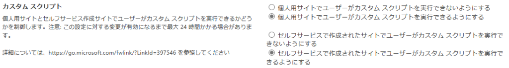

## はじめに

2024年2月9日にメッセージセンターにて発信され、その後、2024年~~3月26日~~3月28日に更新された「MC714186 One Drive と SharePoint のカスタム スクリプト設定を削除する」の内容についてのまとめです。
[Message center - Microsoft 365 管理センター](https://admin.microsoft.com/AdminPortal/Home?#/MessageCenter/:/messages/MC714186)（テナントの管理権限のある方しかアクセスできません）

## 時系列別仕様変更内容の整理

メッセージセンターの内容とM365サポートから頂いた内容を元に整理しました。

### 2024年~~3月~~4月上旬

**①今回の仕様変更の適用を2024年~~11月中旬~~5月上旬まで遅らせるためのPowerShellコマンドの追加**
今回の仕様変更の適用を遅らせるための以下のPowerShellコマンドが追加されます。
`Set-SPOTenant DelayDenyAddAndCustomizePagesEnforcement $True`
このコマンドを実行することで、2024年~~3月~~4月下旬から5月上旬までに適用される以下②③の仕様変更がテナントに適用されるタイミングを2024年~~5月上旬~~11月中旬まで遅らせることができます。

なお、本コマンドがテナントに展開されていない場合は実行してもエラーになります。
~~仕様変更が適用されるまでに本コマンドが利用できるようになるのだろうと思いますが、利用できるようになる時期は明確になっていません。~~

### 2024年~~3月~~4月下旬～5月上旬

以下②③の仕様変更が適用されますが、①のコマンドを実行することで適用を2024年11月中旬まで遅らせることができます。

**②SharePoint管理センターのカスタムスクリプトの設定の項目が削除される**
現時点で設定は以下の個所にありますが、こちらの設定が削除されます。
SharePoint管理センター > [設定] > [クラシック設定ページ]

**③カスタムスクリプトの許可設定が24時間ごとにクリアされ拒否の状態になる**
既存のサイトも新規で作成するサイトもクラシックかモダンかによらずカスタムスクリプトの許可設定を行っていても、24時間ごとに拒否の状態に戻ります。
ただし、以下のクラシックサイトテンプレートは今回の仕様変更の影響を受けません。
仕様変更の影響を受けないサイトテンプレート
・BLANKINTERNETCONTAINER#0 = 従来の発行ポータル サイト
・CMSPUBLISHING#0 = 公開サイト
・BLANKINTERNET#0 = 発行サイト
・GROUP#0 = チーム サイト
・APPCATALOG#0 = アプリ・カタログ
・CSPCONTAINER#0 = CSP コンテナー

### 2024年11月中旬以降

**④カスタムスクリプトの許可設定が24時間ごとにクリアされ拒否の状態になる**
2024年4月に提供される①のコマンドを実行した場合であっても、2024年11月中旬からカスタムスクリプトの許可設定が24時間ごとに拒否の状態に戻ります。

## 仕様変更による影響

SharePoint Online でカスタムスクリプトを利用する場合、Power Shellにて以下のコマンドを実行しカスタムスクリプトを許可する設定を行っているかと思います。
`Set-SPOSite <サイトURL> -DenyAddAndCustomizePages 0`
本仕様変更の影響により、上記コマンドで設定した内容が2024年4月下旬～5月上旬の間(①のコマンドを次項した場合は11月中旬)に24時間ごとにリセットされ拒否の状態に戻る仕様変更が適用されるため、カスタムスクリプトが利用できなくなります。
カスタムスクリプトが利用できなくなることによる影響はこちらのドキュメントに記載があります。
[カスタム スクリプトを許可または禁止する - SharePoint in Microsoft 365 | Microsoft Learn](https://learn.microsoft.com/ja-jp/sharepoint/allow-or-prevent-custom-script#features-affected-when-custom-script-is-blocked)

また、上記ドキュメントに記載の内容の他に、プチカスタマイズの際に重宝するOSSの[Modern Script Editor](https://github.com/SharePoint/sp-dev-fx-webparts/tree/master/samples/react-script-editor)も利用できなくなります。

追記：2024/3/30
ただし、カスタムスクリプトの設定が拒否状態になっていても、許可状態の時にアップロードしたカスタムスクリプトを含むファイルについては、問題なく動作することが確認できました。
その検証結果はこちらにまとめてあります。
[カスタムスクリプトを拒否にした場合のアップロード済みのカスタムページへの影響調査 - SharePoint Developer (orivers.jp)](https://sharepoint.orivers.jp/article/10694)

## カスタムスクリプトを永続的に許可状態にする方法

カスタムスクリプトを永続的に許可状態にするには、上記に記載の Set-SPOSite コマンドを24時間ごとに実行する必要があります。
MSサポートによると設定がリセットされるタイミングは、コマンドを実行してから24時間後とのことですので、任意のタイミングで24時間ごとにコマンドが実行されるように定期バッチを動かす必要があります。
また、①に記載の仕様変更の適用を遅らせるコマンドを実行しない場合、早ければ2024年4月下旬から仕様変更が適用されるため、それまでに24時間ごとにカスタムスクリプトを許可状態にするバッチを実行できるようにしておくか、仕様変更の適用を遅らせるコマンドを実行するようにしてください。

## まとめ

追記：2024/3/30
前述の通り、カスタムスクリプトの設定が拒否になっても、過去にアップロード済みのカスタムスクリプトを含むファイルは問題なく動作することが確認できましたので、本仕様変更のインパクトはそれほど大きなものではないと言えそうですが、常にカスタムスクリプトの登録や更新を許可しておきたいサイトについてはインパクトが大きいですね。

~~これはSharePoint Onlineをカスタマイズしているテナントにとってはそれなりにインパクトのある仕様変更かと思います。
その割には発表されてからわずか2ヶ月3ヶ月で仕様変更を適用するというスピード感・・・
対処策は公開されているもののあまりにも急な展開で準備が追いつかないというのが正直なところかと思いますが、急ぎ準備を進めていくしかないですね・・・
幸い3/22時点でもまだこの仕様変更は適用されていませんが、相変わらず2024年3月から適用すると言われているので、少しでも早くまずは仕様変更の適用を遅らせるコマンドを実行することをお勧めします。~~

何でこんなにも急にこんな仕様変更を実施するんだろうって思っていましたが、調べてみるとカスタムスクリプトを許可するということは、SharePoint Onlineをある程度カスタマイズして利用できるほどのスキルを持っているユーザーなのでバッチを動かすことくらいは問題なくできるだろうということで、良く分からずカスタムスクリプトを許可してしまっているユーザーに対するセキュリティ面での救済処置という位置づけで今回の仕様変更が行われたとかなんとか、海外のブログで書かれている方がいました。
なるほど、それはそうかもしれないなと思いつつ、もう少し余裕を持った対応をして欲しいなと正直思います。
