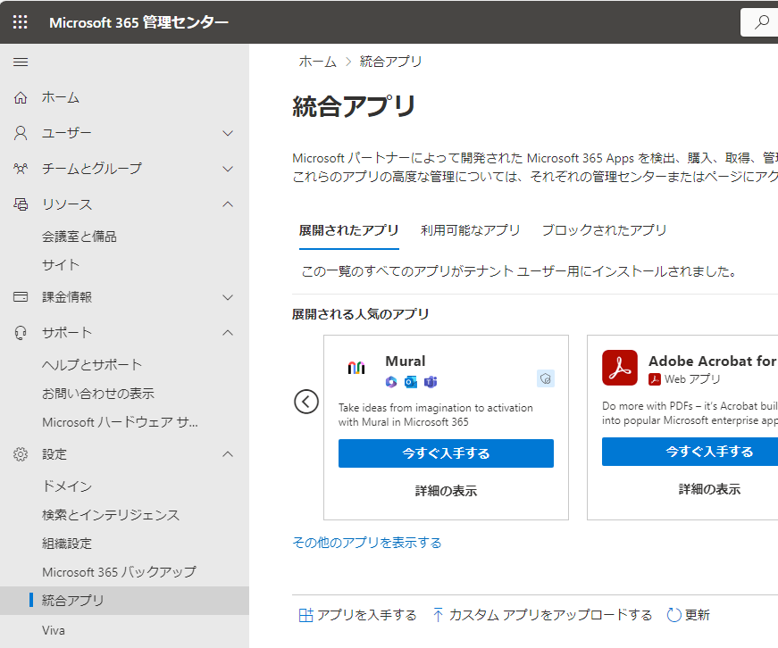
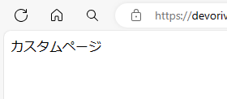
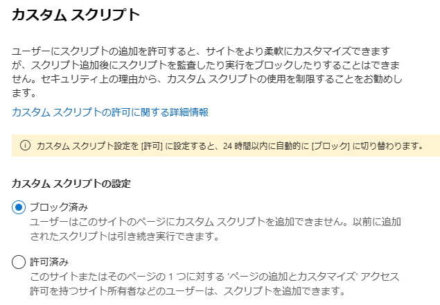
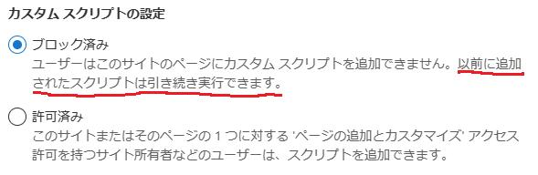

## はじめに

[カスタムスクリプトの許可設定が24時間ごとに拒否に戻されるという仕様変更](https://sharepoint.orivers.jp/article/10680)について、その動向を追いかけているのですが、その中で @hrfmjp さんから以下の投稿をいただきました。


これはどうなるのか調べなければ！！ということで早速調べてみました。

## 検証内容と検証結果

モダンのコミュニケーションサイトを作成し、SharePoint管理センターからカスタムスクリプトの設定を[許可済み]に変更します。


以下の内容の aspx ファイルを作成し、test.aspx として保存します。

```
<html>
<head>
<title>test</title>
<meta http-equiv="Content-type" content="text/html; charset=utf-8">
</head>
<body>カスタムページ</body>
</html>
```

test.aspx ファイルをコミュニケーションサイトのドキュメントライブラリにアップロードします。



test.aspx ファイルをクリックします。
すると、HTMLで記述したページが表示されました。



ページが表示できたのは、カスタムスクリプトの許可がされているからかな・・・・
ということで、続いて、SharePoint管理センターでカスタムスクリプトの設定を[ブロック済み]に変更します。



改めて、test.aspx をクリックすると、、、、


**カスタムページが表示されました！**

つまり、カスタムスクリプトの設定が拒否(ブロック済み)になっていても、許可状態の時にアップロードされた aspx ファイルなどのカスタムスクリプトは問題なく動作するということが確認できました！

SharePoint管理センターのカスタムスクリプトの設定の説明文をよく読んでみると、ちゃんと書いてますね・・・



なお、SharePoint管理センターからカスタムスクリプトの設定を変えるのではなく、SharePoint Onlilne Management Shell を使ってコマンドで設定変更した場合も、上記の検証結果と同じ結果になりました。

## カスタムスクリプトの設定が拒否(ブロック済み)の状態でアップロードしたカスタムスクリプトの挙動

カスタムスクリプトの設定を拒否にしている状態の時にアップロードされたカスタムスクリプトのファイルは、その後、カスタムスクリプトの設定を許可に変更してもブロックされたままでカスタムスクリプトが動作することはありません。

## まとめ

カスタムスクリプトの許可設定が24時間ごとに拒否に戻ることで、過去にアップロードしたカスタムスクリプトも動作しなくなるのかと思っていましたが、その心配はありませんでした！！

念のため、M365サポートにも連絡をしてこの検証結果が正しいかどうかを確認しようかと思います。
(カスタムスクリプトの許可設定が24時間ごとに拒否に戻る仕様変更が発表された当初にM365サポートに問い合わせた時にはカスタムスクリプトが実行できる状態を維持するためには、カスタムスクリプトの許可設定を行う必要があるという旨の回答をいただいていたので)

@hrfmjp さん、コメントいただきありがとうございました！！
