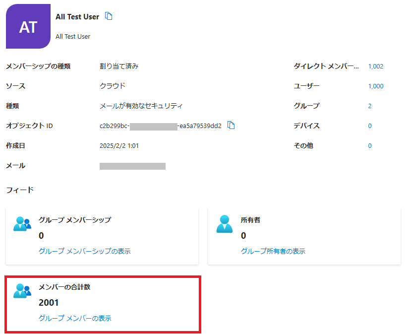
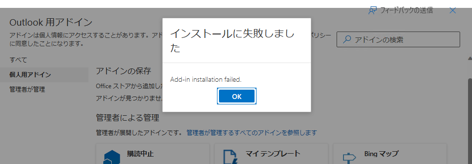

## はじめに

Microsoft Graph API で、セキュリティグループなどのグループのメンバーを推移的に取得する(ネストされたグループのメンバーまで取得する)方法として、[transitiveMembers](https://learn.microsoft.com/ja-jp/graph/api/group-list-transitivemembers?view=graph-rest-1.0&tabs=http) を利用する方法があります。

この一見便利そうな API ですが、実は困った制限があるそうで、その動きを押さえておこうと思って調べてみました。

## 題材となるセキュリティグループ

この記事では以下のセキュリティグループを使って検証をしています。
下図赤枠の通り、メンバー数は2001名で、このグループの下に500名のメンバーを含むセキュリティグループが2つと、直接のメンバーが1001人います。



## 既定で100件、最大でも999件しか取得できない

docs によると、transitiveMembers で取得できるメンバーの数は既定で100件、$top を付けても999件しか取得できないとのこと。



試してみました。

**既定の状態**

```
https://graph.microsoft.com/v1.0/groups/c2b299bc-xxxx-xxxx-xxxx-ea5a79539dd2/transitiveMembers
```

結果の JSON を Excel に読み込ませてみましたが、結果100行でした。


**$top=999 を指定**

```
https://graph.microsoft.com/v1.0/groups/c2b299bc-xxxx-xxxx-xxxx-ea5a79539dd2/transitiveMembers?$top=999
```

結果、999行でした。


docs 通りですね。

**$top=1000 はどうなる？**

```
https://graph.microsoft.com/v1.0/groups/c2b299bc-xxxx-xxxx-xxxx-ea5a79539dd2/transitiveMembers?$top=1000
```

結果は、Graph Explorer で実行したところ以下のエラーになりました。


これまた docs 通り、999より大きい数値は指定できないようです。

## $count を試してみた

transitiveMembers は $count に対応しているということなので試してみました。

```
https://graph.microsoft.com/v1.0/groups/c2b299bc-xxxx-xxxx-xxxx-ea5a79539dd2/transitiveMembers/$count
```

結果は、ちゃんとトータルの件数が返ってきました！


## 結論

transitiveMembers で、グループメンバーのオブジェクトを取得する場合は、
・既定で100件まで
・$top を付ければ最大999件まで
取得可能でした。

$count についてはオブジェクトを取得する場合とは異なり999件という制限はありませんでした。
