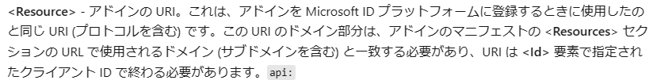

## イベントチャームとは

新しいOutlookに実装されている予定のタイトル左横で指定できるアイコンのことをイベントチャームというようです。
これが正式名かどうかは分からないのですが、調べている限りそういう感じの言い方がされているので、この記事でもイベントチャームと称します。


## イベントチャームのアイコン名を確認する

Graph APIで確認する限りイベントチャームはOutlook予定アイテムのカスタムプロパティとして以下のように登録されています。

```
"singleValueExtendedProperties": [
{
"id": "Integer {11000e07-b51b-40d6-af21-caa85edab1d0} Id 0x27",
"value": "Plane"
}
],
```

このvalueの部分がアイコン名を表しているようなので2025年6月時点でセット可能なアイコンのアイコン名を確認してみました。

## イベントチャームのアイコン名一覧

下図の左上からZ方向にアイコン名を列挙します。
なお、最初の空白は"None"です。
また、2025年6月時点では灰色枠箇所のアイコンはすべてアイコン名が"None"となっており識別ができない状態です。
他アイコンと違ってどこか別の場所に値を持っているのかどうなのかも分かりませんでした。



Plane
Document1
FirstAid
Trophy
Home
Pill
Luggage
Group
Timer
Music
Car
Star
Person
Balloon
ForkKnife
Heart
Soccer
Movie
Books
Cake
Tv
PackageDelivery
Event
CreditCard
