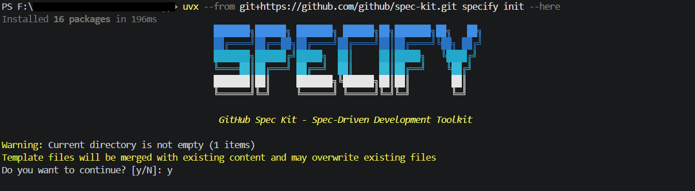
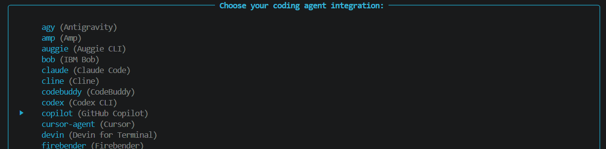

# GitHub Spec Kitによる業務システム開発実践記録（第1回: 環境構築とConstitution作成）

## はじめに

ここ1～2年で、AI を活用したソフトウェア開発は大きく変化してきました。

GitHub Copilot によるコード補完はもちろん、Cursor や Claude Code など、AI を活用した開発ツールが次々と登場しています。
最近では単純なコード生成だけではなく、要件定義や設計から AI を活用する「AI 駆動開発」という考え方も広がりつつあります。

私自身も GitHub Copilot は日常的に利用していますが、これまでは主にコーディング支援として利用しており、AI を中心に据えた開発プロセスに本格的に取り組んだことはありませんでした。

そこで今回、新しいチャレンジとして GitHub Spec Kit を利用したシステム開発に取り組んでみることにしました。

本シリーズでは、新規システムの企画段階から始まり、プロジェクト原則である Constitution の作成、仕様策定、設計、実装、試験、リリースまでの過程を記録として残していく予定です。

私が調べた限りでは、GitHub Spec Kit を利用した実践的な開発事例はまだそれほど多くありません。
そのため、これから AI 駆動開発に取り組もうとしている方や、Spec Kit に興味を持っている方の参考になればと思い、本シリーズを記録として残していくことにしました。

## 今回作るシステム

今回題材に選んだのは、利用者から業務情報や添付ファイルを収集するための Web システムです。

業務内容そのものについては詳細を伏せますが、システムとしては次のような特徴があります。

利用者は年に一度システムへアクセスし、多数の質問に回答します。
回答内容によって表示される質問が変化し、複数の資料をアップロードする必要があります。

さらに、質問項目そのものが毎年変更される可能性があります。

最初は単純な入力フォームシステムを想像していましたが、要件を整理していくにつれて、意外と設計上の考慮事項が多いシステムであることが見えてきました。

## 今回のもう一つの目的

今回の取り組みには、単にシステムを開発するだけではない目的があります。

事前にお客様から受領した要件一覧と質問一覧を元に、Copilot を活用しながら概算の工数見積もりを行いました。

その結果、およそ140人日という見積もりになりました。

一般的な受託開発であれば、複数人の開発チームで進める規模です。

しかし今回は少し事情が異なります。

このシステムは基本的に私一人で開発する予定です。
また、日中は本業があるため、このシステムだけにフルタイムで取り組めるわけではありません。

平日は1日1時間程度、休日にまとまった時間を確保しながら進めることになる見込みです。

単純に考えれば、140人日規模と見積もられたシステムをこの条件で開発するのは簡単ではありません。

そこで今回のシリーズでは、AI 駆動開発を活用することでどの程度開発生産性を向上できるのかという点もあわせて検証していこうと考えています。

このシリーズは開発記録でもありますが、AI を開発プロセスへ組み込むことでどこまで工数を圧縮できるのかを確認する実験でもあります。

## まずは Spec Kit を学ぶ

Spec Kit を利用すると決めたものの、最初は何から始めればよいのか分かりませんでした。

そこでまず、GitHub Spec Kit の公式ドキュメントと Quick Start を確認しました。Spec Kit 自体の考え方や、仕様策定から実装までの流れを理解することが目的です。

また、Microsoft Learn にも GitHub Spec Kit の学習コンテンツが公開されていたため、こちらもあわせて確認しました。

参考にした資料は以下です。

- GitHub Spec Kit Documentation  
  <https://github.github.com/spec-kit/>

- GitHub Spec Kit Quick Start Guide  
  <https://github.github.com/spec-kit/quickstart.html>

- GitHub Spec Kit を使用して Spec-Driven 開発を実装する  
  <https://learn.microsoft.com/ja-jp/training/modules/spec-driven-development-github-spec-kit-enterprise-developers/>

普段のシステム開発では、要件定義書や設計書の作成から始めることがほとんどです。

しかし Spec Kit では最初に Constitution を作成する流れになっています。

この時点で、これまでの開発プロセスとは少し違った考え方で進めることになると感じました。

## 環境構築

実際に Constitution を書き始める前に環境構築を行いました。
今回の環境は以下の構成です。

- OS : Windows 11
- エディタ : Visual Studio Code
- AI エージェント : GitHub Copilot
- パッケージ管理 : uv
- ソースコード管理 : Azure DevOps Repos
- Spec Kit : GitHub Spec Kit

開発を始めるにあたり、まず Azure DevOps 上に今回のシステム用の Git リポジトリを作成しました。

今回は実際の業務システムとして開発を進めるため、ローカル環境だけで作業するのではなく、最初からソースコード管理を前提に環境を準備しています。

Azure DevOps 上で空のリポジトリを作成した後、そのリポジトリを Visual Studio Code から clone し、今回の作業ディレクトリとして利用することにしました。

### uv のインストール

GitHub Spec Kit は Python ベースのツールとして提供されているため、まずは公式でも推奨されているパッケージマネージャーである uv をインストールしました。

Windows 11 では PowerShell を起動し、以下のコマンドを実行します。

```powershell
powershell -ExecutionPolicy ByPass -c "irm https://astral.sh/uv/install.ps1 | iex"
```

インストール後、以下のコマンドで動作確認を行います。

```powershell
uv --version
```

バージョン情報が表示されれば正常にインストールされています。

### Spec Kit の初期化

続いて、Azure DevOps から clone したリポジトリフォルダを Visual Studio Code で開き、統合ターミナルから Spec Kit を初期化しました。

```powershell
uvx --from git+https://github.com/github/spec-kit.git specify init --here
```



初回実行時には利用する AI エージェントの選択が求められます。

今回は GitHub Copilot を選択しました。



また Windows 環境のため、スクリプト形式は PowerShell を選択しています。Spec Kit は Windows 環境では PowerShell を標準でサポートしています。

### Initial Commit

Spec Kit の初期化が完了すると、Constitution や Spec を管理するためのディレクトリやテンプレートファイルが生成されます。

この時点で生成されたファイルを Azure DevOps のリポジトリへコミットし、開発開始時点の状態として保存しておきました。

今回の取り組みでは、Constitution や Spec といったドキュメントもソースコードと同様に履歴管理していく予定です。
そのため、できるだけ早い段階から Git による変更管理を行うことにしました。

### ここまでの所要時間

今回の環境では、Azure DevOps のリポジトリ作成、uv のインストール、Spec Kit の初期化、Visual Studio Code での動作確認まで含めて約 30 分程度でした。

もちろん初めて利用するツールだったため、途中で公式ドキュメントや Microsoft Learn を確認しながら進めています。

ただし環境構築そのものは比較的スムーズで、大きくハマるポイントはありませんでした。

この時点で、

- ソースコード管理は Azure DevOps
- 開発環境は Visual Studio Code
- AI エージェントは GitHub Copilot
- Spec-Driven Development は GitHub Spec Kit

という今回の開発を進めるための基本環境が整いました。

## Constitution を作る前に要件定義を整理した

Spec Kit の初期化が済んだことで、.specify/memory/constitution.md が生成されたので、いよいよ Constitution の作成に入るのですが、実際にはその前に、今回開発するシステムについて AI に要件整理をしてもらっていました。

お客様から受領した質問票と要望書を元に、Claude と Copilot の両方へ要件定義の作成を依頼したのです。

目的は要件定義書を完成させることではなく、AI ごとにどのような設計提案の違いが出るのかを確認することでした。

実際に比較してみると、この段階で興味深い差が出ました。

Claude が提案したのは比較的オーソドックスな設計です。質問票に対応した入力画面を作成し、その画面で利用者が入力する構成になっていました。

一方で Copilot は別の提案をしてきました。

質問項目そのものを JSON として管理し、その JSON をもとに画面を生成するという構成です。

つまり、質問票を画面として実装するのではなく、質問票そのものをデータとして管理するという考え方でした。

## Copilot 案を採用した理由

個人的には、最初に要件を読んだ段階から気になっていたことがありました。

それは、質問項目が毎年変わる可能性があるという点です。

質問内容が変わるたびに画面を改修してリリースするよりも、質問定義そのものを設定データとして管理できた方が保守性は高くなります。

そのため、質問追加や削除、必須設定の変更、多言語対応の追加といった変更は、できる限り設定変更だけで対応できる構造の方が望ましいと考えていました。

Copilot の提案は、その考え方と一致していました。

もちろんこの時点では実現方法まで整理できていませんでしたが、少なくともシステムの方向性としては JSON ベースの質問定義管理を採用することにしました。

今振り返ると、この判断が後で作成する Constitution の内容にも大きく影響しているように思います。

## Constitution を書き始める

これで Constitution を書く準備ができました。

Constitution は日本語にすると「原則」に近い意味です。

まだ画面設計もしていませんし、データ設計もしていません。

しかし最初に Constitution を作るのは、このプロジェクトで何を重視するのかを明文化するためです。

設計や実装が始まると、シンプルさを優先するのか、柔軟性を優先するのか、あるいは将来の拡張性を優先するのかといった判断が数多く発生します。

その判断基準を先に定義しておくというのが Constitution の役割です。

## Constitution も AI との共同作業だった

Constitution についても、完全にゼロから書き始めたわけではありません。

先ほど整理した要件定義の内容やシステムの特徴を Copilot へ渡し、まずはプロジェクト原則のたたき台を作成してもらいました。

その後、本当に必要な原則なのか、システムの特徴に合っているのか、将来的な運用を考えて妥当なのかという観点で手作業による見直しを行いました。

さらに GitHub Copilot との対話を繰り返しながら、不足している観点を補完し、最終的な Constitution を作成しています。

作成した Constitution では、ビジネス要件を最優先に考えること、過度な複雑化を避けること、設定駆動で設計すること、多言語対応を前提とすること、そして Azure を前提としたクラウドネイティブな構成とすることを原則として定義しました。

特に今回のシステムでは設定駆動（Configuration Driven）を重視しています。

質問項目はコードではなく設定データで管理し、質問追加や削除、多言語対応などを可能な限り設定変更だけで実現できるようにする方針です。

また、Azure Static Web Apps、Azure Functions、Azure Blob Storage、Azure Entra ID を中心としたクラウドネイティブな構成を前提としました。

このあたりは要件整理の段階で見えてきたシステムの特徴を反映した内容になっています。

## Constitution を作って感じたこと

Constitution を作成する過程で、設計方針や運用方針を整理することができました。

従来の開発では、設計思想そのものは設計者や開発者の頭の中にあることも少なくありません。

しかし Constitution を先に作ることで、なぜその設計を採用するのか、何を優先するのか、そしてどのようなトレードオフを許容するのかを文章として整理できます。

まだコードは1行も書いていませんが、今後の設計や実装の前提となる考え方は整理できたように思います。

## ここまでの作業時間

今回の取り組みでは、開発だけでなく作業時間についても記録していくことにしています。

将来的に振り返った際に、AI を活用することでどの程度効率化できたのか、そして 140 人日と見積もられたシステムをどの程度の実作業時間で開発できたのかを確認できるようにしたいためです。

なお、ここで記録している時間には、GitHub Spec Kit の公式ドキュメントや Microsoft Learn を利用した事前学習時間は含めていません。

ただし実際の作業中は、環境構築の手順や Spec Kit の進め方、Constitution に記載する内容、ベストプラクティスなどを都度公式ドキュメントで確認しながら、GitHub Copilot と相談しつつ進めています。

現時点での作業時間は以下の通りです。

| 作業内容 | 作業時間 |
|----------|----------:|
| GitHub Spec Kit の環境構築 | 約30分 |
| 要件整理（質問票・要望書の分析） | 約2時間 |
| Claude・Copilot による要件定義の比較検討 | 約1時間 |
| Constitution 作成・レビュー・修正 | 約2時間 |
| 合計 | 約5.5時間 |

作業時間はおおよその実測値です。

現時点ではまだコードを1行も書いていませんが、システム概要の整理、要件定義のたたき台作成、JSON ベースの質問定義という方向性の決定、そして Constitution の作成までは完了しています。

もちろん今後の実装や試験でどこまで効果が出るかは分かりませんが、少なくとも企画・要件整理フェーズについては AI の支援を受けながら短時間で整理できている感触があります。

本シリーズでは引き続き作業時間も記録しながら進めていく予定です。

## 今回の成果物

今回の作業では、GitHub Spec Kit の開発環境を構築し、システム概要を整理したうえで constitution.md を作成しました。

実装という観点ではまだ最初の段階ですが、プロジェクトの方向性を整理するための土台は作ることができました。

## 次回予告

次回は Constitution をもとに Spec 作成へ進みます。

Spec.md をどの粒度で分割するべきか、機能をどのような単位で整理するべきか、そして今回採用した質問定義 JSON の考え方をどのように仕様へ落とし込むのかを整理していく予定です。

また、開発の過程では工数や作業時間も記録し、当初 140 人日と見積もられたシステムがどのように進んでいくのかも追いかけていきたいと思います。
