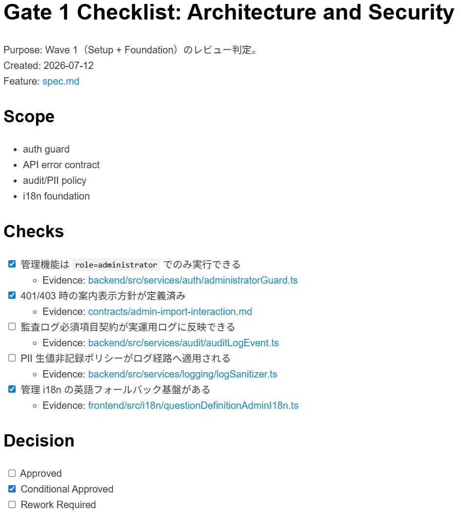
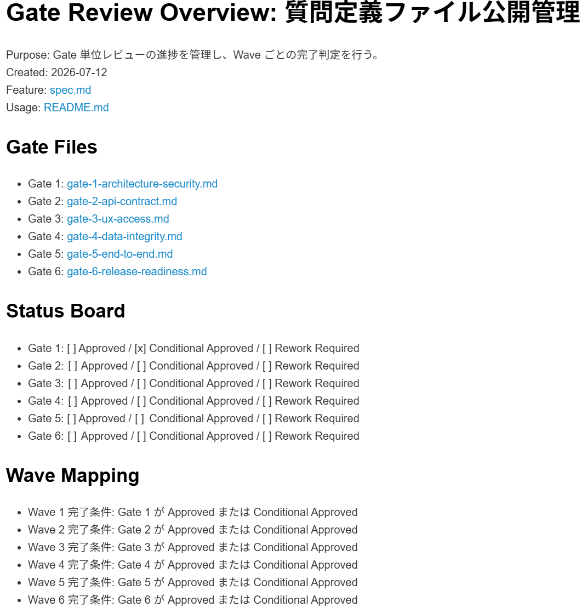

---
title: "GitHub Spec Kitによる業務システム開発実践記録（第4回: 実装とテスト）"
date: 2026-07-18
draft: false
description: "GitHub Spec Kitを使って業務システムを開発する実践記録の第四弾として、質問定義ファイル公開管理機能の実装とテストの流れをまとめました。"
slug: "github-speckit-dev-04"
tags:
  - GitHub Copilot
  - Spec Kit
  - AI 駆動開発
  - Implement
  - 実装
  - React
  - Azure Functions
categories: ["AI駆動開発"]
showToc: true
tocopen: true
---

# GitHub Spec Kitによる業務システム開発実践記録（第4回: 実装とテスト）

## はじめに

前回の記事では、質問定義ファイル公開管理機能について、Plan・Tasks・Analyze までを進め、実装に入る準備が整ったところまでをまとめました。

前回の記事はこちらです。<br/>
[GitHub Spec Kitによる業務システム開発実践記録（第3回: Plan・Tasks・Analyzeで実装準備を整える）](https://sharepoint.orivers.jp/posts/github-speckit-dev-03/)

今回はその続きとして、Implement から Converge までの作業をまとめたいと思います。

今回の実装では、あらかじめ機能を6つの Wave に分解し、その単位で開発を進めました。<br/>
最初はシンプルに進める想定でしたが、実際には実装プロセスの試行錯誤も含みながら進んでいくことになります。

## 実際の作業の流れ（Wave 進行の全体像）

前回、1 機能を 6 つの Wave に分割して実装を進めることにしたため、以下の流れで作業を進めていきました。

- Wave 1 実装 → Gate チェック → Commit
- Wave 2 実装（途中でやり直しあり） → Gate チェック → Commit
- Wave 3 実装 → Gate チェック → Commit
- Wave 4 実装 → Gate チェック → Commit
- Wave 5 実装 → Gate チェック → Commit
- Wave 6 実装 → Gate チェック → Commit
- 最後に Converge → Commit → Pull Request

## Wave 1：実装とレビュー方法の確立

Wave 1 では、実装そのものに加えて「レビューの進め方」を固めることに多くの時間を使いました。

実装は `/speckit.implement` で開始するのですが、今回は実装を Wave ごとに行うことにしたため、`/speckit.implement` に指示文を加えることで指定の Wave のみ実行するようにしました。
例として Wave 1 の指示文を記載します。

```text
/speckit.implement 対象は Wave 1 のみ。対象TaskIDは tasks.md の Review-Gated Execution に従って実装してください。
完了条件:
- Wave 1 対象外は実装しない
- 変更ファイル一覧とタスク対応表（TaskID -> file）を提示
```

この指示文は GitHub Copilot にまとめて生成してもらいました。

実装が完了するとユニットテストが自動実行されます。<br/>
ユニットテストまで完了すると、タスクで定義した通り、認証ガードや監査ログ、ドメインモデルなど、後続の Wave の土台となる部分が実装されていました。

その後、実装されたコードを一つずつ確認して問題ないかを目視でチェックします。<br/>
さらに、実装されたコードが仕様をきちんと満たしているかを機械的にチェックし、次の Wave に移っても問題ないかを判断するための仕組みとして、Wave ごとに Gate チェックを行うルールを定めました。

Wave が完了して次の Wave に行く前に Gate チェックを行って、直近の Wave の実装が仕様通りに完了しているかをチェックするというものです。<br/>
チェック内容は GitHub Copilot に全 Wave 分まとめて生成してもらいました。<br/>
チェックそのものも GitHub Copilot に「Gateチェックをして」と依頼して実施してもらい、チェック状況を記録するところまでを自動で行います。



この進め方によって、コードレビューで細かなところをチェックするだけでなく、仕様の不足をその場で補いながら進める形になり、「仕様・実装・レビュー」が一体化したプロセスになっていきます。

## Wave 1 完了と Wave 2 の開始

Wave 1 の対象タスクがすべて完了したあと、Gate 1 チェック前にコードの目視確認をしたところ、プロジェクト原則(constitution.md)に書いたコーディング規約が守られていないことが判明しました。

constitution.md に記載したことは絶対に守られると思っていたのですが、何度試してもダメで、GitHub Copilot から代替案として、実装時に constitution.md を参照するように `/speckit.implement` の指示文に一行加える案が提示されたので、その対応をしました。

具体的には以下の一行を指示文に追加しました。

```text
- .specify/memory/constitution.md に基づく準拠チェック結果（遵守/差分/是正内容）を提示
```

そして、Gate 1 チェックが完了したあと、Wave 2 の実装を開始するタイミングで問題が起きました。

Spec Kit の標準フローでは、`/speckit.implement` を実行する際に checklists フォルダ配下のチェックリストが未完了の場合に実装の継続を止めるストッパーがあるため、Wave 2 の実装が開始できない状態になってしまいました。

何のチェックリストに反応してしまっていたかというと、各 Wave で行う Gate チェックのチェックリストです。

当然のことながら今は Wave 1 しか実施していないため、Gate 1 のチェックリストのみチェックマークがついた状態なのですが、それ以外の Gate チェックはチェックマークがついていないため通過できるはずがありません。<br/>
しかし、Spec Kit はすべての Gate チェックのリストを参照し、チェックがされていないからということで実装を止めたということです。

ここは調べてないので推測ですが、最初 `/speckit.tasks` でタスクを作った際には Wave の概念がありませんでした。<br/>
また、チェックリストも当然 Wave という概念はなく、実装を開始するために必要なチェック項目が記載された `requirements.md` のみが存在していました。

今回 Wave に分割するのと合わせて、Wave 毎のチェックリストを作成した訳ですが、Spec Kit のチェックルールまでは変更していなかったため、このような問題が起きてしまったのだろうと思います。

## Gate 運用の再設計

この問題を解決するために、チェックリストと Gate の運用を大きく見直しました。

見直し後の新しいルールを以下のようにしました。

- 各 Gate チェックのチェック状況が一目で分かるように gate-overview.md を作成し Status Board で状況を管理
- Gate チェック時の判定は gate-overview.md の Status Board のみを参照する
- 判定対象は「これから実行する Wave の直前の Gate のみ」



また、このルール通りに Gate チェックが行われるように、`/speckit.implement` の指示文を以下のように改良しました。

```text
/speckit.implement 対象は Wave 1 のみ。対象TaskIDは tasks.md の Review-Gated Execution に従って実装してください。
実装開始条件: なし（Wave 1 は最初のGateのため開始時点のGateチェック不要）。
完了条件:
- Wave 1 対象外は実装しない
- 変更ファイル一覧とタスク対応表（TaskID -> file）を提示
- Gate 1 レビュー観点（auth/API error/audit/PII/i18n foundation）に対する自己チェック結果を提示
- .specify/memory/constitution.md に基づく準拠チェック結果（遵守/差分/是正内容）を提示
```

この整理によって、ようやく実装を止めずに進められる状態になりました。

## Wave 2 やり直し後の再開

運用が整ったことで、改めて Wave 2 の実装に入ります。

直前の Gate が Conditional Approved の状態だったため、ルールに従って実装を再開できるようになりました。

Wave 2 では、インポート API を中心とした機能が実装され、バックエンドからフロントエンドまで一気に整備されています。

このタイミングで、ようやく「Wave → Gate → 次Wave」という流れが安定して回り始めました。

## Wave 3〜Wave 6：安定した繰り返し

Wave 2 以降は、同じサイクルを繰り返して進んでいきました。

Wave 3、Wave 4、Wave 5、Wave 6 と進める中で、それぞれ実装の後に Gate チェックを行い、問題があれば次の Wave に進まず、問題点をつぶしてから次の Wave を実装するという流れになっています。

この段階では運用も安定しており、

- 対象 Wave の範囲だけを実装し
- 直前 Gate だけを確認し
- 未完部分があれば即対応

という進め方が自然に回るようになっていました。

## Implement の特徴：テスト込みの実装

今回の Implement では、コードだけでなくユニットテストも同時に生成・実行されるため、Wave ごとにロジックの正しさは常に確認できる状態でした。

そのため、少なくとも「コードとしては正しい」という安心感を持ちながら進めることができました。

## Wave 粒度の課題

一方で、実際に進めてみると、Wave の粒度について課題も見えてきました。

作業ログを見ると、1 Wave の実装が概ね数分で終わっており、非常にテンポよく進んでいきます。

その結果、進行を常に追い続ける必要があり「効率的」というよりも「目が離せない開発」になってしまいました。

Wave 分割自体は有効ですが、粒度の見直しは必要だと感じています。

## 最後まで残った不安

今回の進め方で最後まで残ったのは、UI の確認ができていない点です。

ユニットテストはすべて通っているため、コードとしては完成していますが、実際の画面や操作感については検証できていません。

そのため「実装は完了しているが、ユーザー体験としては未検証」という状態で各 Wave が終わっています。

## Converge と現在の状態

すべての Wave 完了後、最後に `/speckit.converge` を実行し、生成されたコードが仕様をきちんと満たしているかを全体的にチェックします。

このチェックが通過して、初めて機能の実装が完了となります。

ただし、UI を実際に動かして確認している訳ではないので、あくまでもコードとして完成しているだけであって、機能として完成している状態ではないということを認識しておかなければなりません。

## ここまでの作業時間

今回の作業時間は約2.5時間でした。

前回の作業までが約12.5時間だったので、ここまでの累計作業時間は約15時間になります。

クレジット消費は約2,000で、ここまでの累計が約3,350程度になります。

## おわりに

今回の Implement から Converge までの流れは、単なる実装作業ではなく、開発の進め方そのものを調整していくプロセスでした。

特に印象的だったのは、Gate チェックはそのままでは運用できず、プロンプトやルールとして明確化して初めて回り出すという点です。

また、Wave 分割は非常に有効である一方で、その粒度によって開発体験が大きく変わることも分かりました。

## 次回予告

次回は、今回実装した機能を実際に触れる状態にすることを目指して進めていきます。

現状では、今回開発した画面を開くための導線がまだ存在していないため、まずは認証機能とホーム画面の実装を行い、画面を表示できるようにします。

その上で、UI を実際に確認するために、ブラウザ上で動作させ、実際の操作感を検証できる状態まで持っていく予定です。
